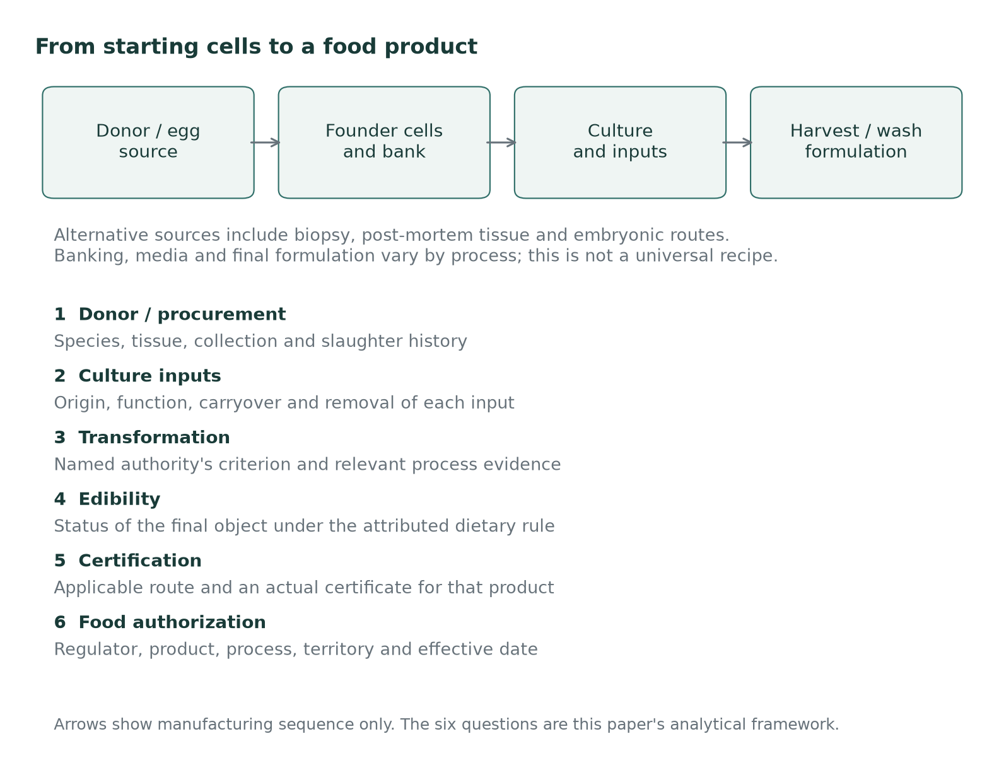
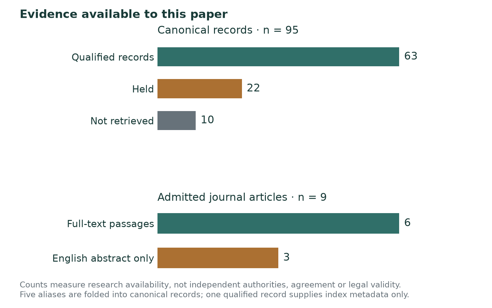
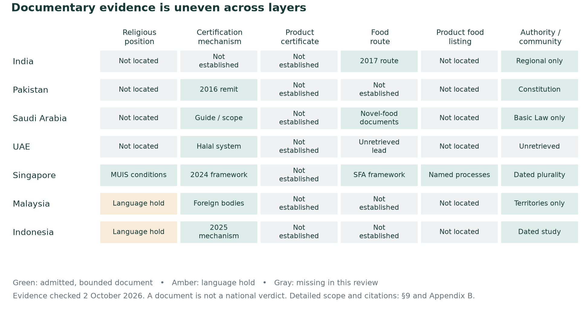

# Cultivated Chicken and Halal Market Access

AI-assisted working draft; human verification pending

Religious conditions, certification and food authorization in selected legal sources and seven country cases

Muhammad Umar Zafar · Working paper · 2 October 2026

## Abstract

What must be established before a specified cultivated-chicken product can reach Muslim consumers through the relevant religious, certification and food-authorization processes? This paper separates donor procurement, culture inputs, transformation, category and edibility, certification, and food authorization. It compares attributed conditions rather than deriving a universal verdict. IIFA’s conditional resolution and MUIS’s guidance illustrate why a religious position must be distinguished from evidence that a product meets its conditions or holds a certificate. A useful assessment must identify the authority, product, process and scope of the decision being examined.[^a-01][^a-02] <!-- trace: I03 R01 R02 P-MUIS-RELEASE | kind: mixed -->

The method combines passage-level source checking with an explicit distinction between documentary evidence, analytical inference and unresolved gaps. Retrieval success alone does not establish support for a claim. The research frame spans five legal traditions and seven country cases, with uneven source readiness retained in the comparison. Some scholarly works enter only through available English abstracts; unreviewed-language texts and unsuccessful retrievals remain outside substantive use. The paper is an AI-assisted documentary analysis, not a systematic review or a scholarly ruling. Human scholarly review remains pending. <!-- trace: P-METHOD-INTERNAL | kind: evidence -->

The resulting framework identifies the dossier needed to resolve a named case: procurement and ingredient histories, evidence for any claimed transformation, the applicable religious determination, and separate certification and access documents. A complete current decision can close its scoped question without eliminating disagreement elsewhere. The quantitative handoff remains blocked by missing compatible inputs; the paper supplies no adoption forecast, national access estimate or product certification. Its contribution is a traceable set of conditions and remaining decision points.[^a-01][^a-02] <!-- trace: I03 P-GAP-BRIDGE-V2 | kind: inference -->

## 1. Introduction

Singapore’s food list distinguishes serum-containing and serum-free processes for cultivated chicken. Its Islamic Religious Council, MUIS, separately describes conditions concerning the source animal, production ingredients, cleanliness and safety. These documents answer related questions, but combining them does not identify a halal certificate for a particular product. A producer, researcher or consumer must still establish which process a decision covers and what kind of decision it is. This paper begins with that practical problem: how to connect religious analysis to the institutional evidence needed for a specified cultivated-chicken product in a specified market.[^s1-01][^s1-02] <!-- trace: P-SG-PROCESS-LIST P-MUIS-RELEASE I03 | kind: mixed -->

The proposed framework separates six questions. Donor and procurement concern the animal and the circumstances in which the original material was taken. Culture inputs concern the substances used during production. Transformation concerns any legally consequential change in those substances or the resulting material. Category and edibility concern the food’s classification and permission to consume it. Certification and food authorization then concern decisions by the relevant institutions. These divisions are the paper’s analytical proposal. They allow the reader to locate a disagreement without assuming that the authorities examined organize their reasoning in precisely the same way.[^s1-02][^s1-03] <!-- trace: I03 | kind: inference -->

The International Islamic Fiqh Academy’s 2025 resolution shows why the conditions must remain connected. It retains living-donor and lawfully slaughtered-donor alternatives, while also addressing prohibited media and substances, specialist oversight, disclosure and safety. The donor clause therefore cannot stand in for the whole position. Nor can the resolution be read as a certificate for a manufacturer or a civil authorization in a destination country. It supplies an institutional position against which a disclosed process could be considered. That distinction permits a useful finding about religious conditions while leaving actual compliance as a separate evidential question.[^s1-03] <!-- trace: R01 R02 I03 | kind: mixed -->

Food regulation supplies another part of the account. SFA’s framework requires premarket review for covered novel foods and describes safety assessment and the possibility of cancellation. Its process list records particular entries, including the distinct cultivated-chicken processes discussed here. Those entries are more specific than a general framework, yet they still carry the scope of the listed food decisions. The practical analysis must match the product and process under consideration to the document that addresses them. An authorization for one process cannot be assigned to another merely because both products are sold under a cultivated-chicken description. The date and scope of the decision also matter: an earlier document may not describe a changed formulation, and the record must be checked before a new application.[^s1-01][^s1-04] <!-- trace: P-SG-FOOD-FRAME P-SG-PROCESS-LIST | kind: mixed -->

There is a strong practical objection to adding a comparative paper to this work. For a producer in one jurisdiction, the current position of the relevant authority, a certifier’s requirements and the regulator’s product decision may answer the immediate question more directly than a reading of classical texts. If a complete dossier supplies those decisions and demonstrates that their conditions are met, the research should recognize what has been resolved. Continued disagreement in other sources need not turn that specific result into permanent uncertainty. The framework is useful only if it identifies a material question or a mismatch of scope that would otherwise remain hidden.[^s1-02][^s1-03] <!-- trace: I03 | kind: inference -->

The comparisons therefore test places where the object or decision changes. The original sample, founder line and later biomass may require distinct arguments. A serum-free food-process entry may leave earlier banking stages undocumented. Religious guidance may identify acceptable conditions while leaving the certification procedure unfinished. The paper does not presume that each distinction will determine the outcome. It asks whether the evidence supports carrying a finding from one stage or institutional setting to another. Where it does, the connection should be stated; where it does not, the missing fact or interpretation should be identifiable.[^s1-01][^s1-05] <!-- trace: H03 H04 P-MUIS-BOOK-DONOR | kind: inference -->

The research frame covers five legal traditions and seven country cases. India, Pakistan, Saudi Arabia and the United Arab Emirates are the focal cases, with Singapore, Malaysia and Indonesia providing additional precedents. This arrangement does not rank countries by religious acceptance or imply equal coverage of their institutions. The classical comparison is also uneven: some passages qualify for citation with explicit limits, while other works remain held or unretrieved. The contribution is an attributed documentary comparison whose coverage and exclusions can be inspected, rather than a complete representation of every tradition or a numerical measure of agreement. <!-- trace: P-METHOD-INTERNAL | kind: evidence -->

The paper first describes production and vocabulary, then examines prior scholarship and the evidence method. Sections 5–8 follow donor procurement, culture inputs, transformation and edibility. Section 9 separates institutional positions, geography and national mechanisms. The historical comparisons in section 10 test proposed connections between older rules and modern processes, while section 11 specifies the evidence needed for a product assessment and the Phase Two handoff. Appendices retain the comparison slots, country layers, open questions and citation limits. The resulting framework is intended to make a decision’s evidential requirements clearer while preserving what the available documents leave unresolved. <!-- trace: | kind: framing -->

## 2. Production and legal vocabulary

Cultivated meat begins with cells, but that description leaves several possible starting points. Reiss, Robertson and Suzuki’s 2021 review distinguishes primary cells obtained through a tissue biopsy or post-mortem tissue from pluripotent sources, including embryonic and induced pluripotent cells. Its general workflow then describes obtaining the relevant progenitor cells, expanding them, and supporting maturation. These alternatives matter because a source description such as chicken-derived does not say how the original material was procured. The review provides a technical map of possibilities. A particular manufacturer’s process must be established from its own evidence rather than assumed to follow every step shown in that map.[^s2-01] <!-- trace: P-PROCESS-REISS21 | kind: mixed -->

Within that review, expansion increases the number of cells, while differentiation and maturation concern their development into the intended cell types and tissue. The described workflow uses a bioreactor for expansion and a compatible scaffold to support later development and structure. It is explicitly a general workflow that can be changed for particular applications. The present paper uses it to distinguish stages, without requiring every cultivated product to use the same scaffold or organization. Religious assessment must therefore begin with the actual source and process; resemblance to a generic diagram is insufficient evidence about a named product’s ingredients.[^s2-01] <!-- trace: P-PROCESS-REISS21 | kind: mixed -->

Cell banking adds a stage documented in the GOOD Meat applicant dossier. The company describes a master cell bank from which working banks are derived, followed by thawing and seed expansion. Its production account then traces scale-up into bioreactors. After growth, it describes concentration and washing of the cells, packaging and frozen storage for use as a chicken ingredient. This account connects the stored cell material to the manufacturing run. It remains an applicant’s description hosted by the FDA; the hosting institution does not become the author of the process account or issue a religious finding through its publication.[^s2-02] <!-- trace: P-PROCESS-GOOD | kind: evidence -->

The distinction between a process and a product label also appears in Singapore’s food list. It records Eat Just’s serum-containing and serum-free processes separately and identifies Vital Meat’s embryonic chicken-cell biomass. These entries provide evidence of specified processes at their stated dates. They do not supply the complete history of every bank or establish religious certification. MUIS’s separate discussion of egg embryos further shows why the starting route deserves its own description. A comparison should identify the original sample, the established line, the stages of cultivation and the harvested material before asking which of them a cited rule addresses.[^s2-03][^s2-04] <!-- trace: P-SG-PROCESS-LIST P-MUIS-BOOK-DONOR H04 | kind: mixed -->

Several legal terms help locate that question. *Maytah*, rendered here as carrion, is a legal category whose application cannot be determined by a cell-viability result. Ibn Abidin’s discussion applies a carcass classification to parts detached from a living animal, while distinguishing removal after effective slaughter and preserving specified exceptions. The rule concerns the circumstances of separation, even though the donor remains alive. Whether the same category extends to an isolated founder line and later biomass requires a further argument. A biological description of viable cells and an attribution of legal status therefore answer different questions.[^s2-05] <!-- trace: S01 H04 | kind: mixed -->

As used here, *dhabiha* concerns prescribed slaughter, and *tasmiya* denotes invocation of God’s name in that act. Their requirements must be attributed to the relevant account. Sistani’s ruling on invocation, for example, distinguishes the slaughterer’s act from another person’s invocation and distinguishes forgetting from omission through ignorance. Qur’an 6:121 supplies the scriptural invocation anchor, while 5:3 addresses prohibited circumstances of animal death. These sources explain why donor documentation may require more than a species name or a statement that the animal died. They do not themselves provide a protocol for the subsequent cultivation process.[^s2-06][^s2-07][^s2-08] <!-- trace: J-Q5 T01 | kind: mixed -->

Purity and permission to eat must also remain separate. Sistani’s fishing rules give a bounded example: under the stated circumstances a fish that dies in water may remain pure while its consumption is prohibited, with a distinct exception for death in a fishing net. His Arabic answers likewise distinguish the purity of bones from permission to consume them or their extracts. The paper consequently uses impurity and prohibition as different questions, rather than treating one as a complete answer to the other. Qur’an 7:157 supplies the *tayyib* and *khabith* vocabulary, rendered as lawful and impure in Mustafa Khattab’s translation; section 8 examines attributed interpretations.[^s2-09][^s2-10][^s2-11] <!-- trace: J-Q8 S06 I03 T01 | kind: mixed -->

*Istihalah*, transformation, concerns a legally consequential change of substance under the position being applied. Sistani distinguishes a change in essence from ordinary processing and retains the previous impurity ruling when transformation is uncertain. IIFA’s transformation discussion distinguishes complete change from partial chemical interaction. Its account of *istihlak*, absorption or dilution, instead concerns one material losing its identifiable characteristics within another, while deferring further discussion of the subject. These concepts should not be treated as interchangeable descriptions of washing, growth or reduced concentration. Each proposed application needs the relevant criterion and evidence about the material before and after processing.[^s2-12][^s2-13] <!-- trace: S05 H01 H03 | kind: mixed -->

Figure 1 brings these distinctions together as the paper’s organizing framework. The production branches identify different objects for examination, while the overlay asks about donor procurement, inputs, transformation, category and edibility, certification and food authorization. Following an arrow describes movement through an inquiry; it does not indicate religious permission. This arrangement lets the reader see why a rule about a source sample may leave the later biomass unresolved, or why a finding about an ingredient may leave certification untouched. The comparison that follows returns to the particular authority, passage and process at each point.[^s2-05][^s2-10] <!-- trace: H04 I03 | kind: inference -->

<!-- trace: | kind: framing -->

Figure 1. A schematic workflow with alternative starting materials. Manufacturing stages draw on the cell-source review and the applicant dossier; SFA lists document process variation. The six-question overlay is this paper’s analytical framework. Arrows indicate sequence, with no permission or authorization implied.[^s2-01][^s2-02][^s2-03] <!-- trace: P-PROCESS-REISS21 P-PROCESS-GOOD P-SG-PROCESS-LIST | kind: mixed -->

## 3. Prior scholarship

The literature considered here offers several ways to frame the religious question, with different source and reading limits. Hamdan and colleagues’ earlier article is cited from its English abstract in an institutional publication record; its issue year is 2018, following online publication in 2017. Kashim and colleagues’ article appeared online in 2022 and belongs to a 2023 issue. Those dates should not create duplicate studies or obscure which publication is being discussed. The selection permits a comparison of specific arguments, without claiming an exhaustive literature review or priority for organizing the problem around production stages.[^s3-01][^s3-02] <!-- trace: P-LIT-HAMDAN18 P-LIT-KASHIM23 | kind: mixed -->

Hamdan, Post, Ramli and Mustafa’s abstract describes a conditional route: the source cells should come from a lawfully slaughtered permitted animal, and production should avoid blood or serum. That proposition places procurement and inputs at the center of assessment. Because only the abstract was available for the admitted reading, the present paper does not reconstruct the article’s full reasoning or assign every premise to a particular classical source. Its contribution here is an attributed scholarly position. Whether a named institution adopts that position, or a manufacturer meets its conditions, requires evidence beyond the article’s abstract.[^s3-01] <!-- trace: P-LIT-HAMDAN18 | kind: mixed -->

The 2024 review by Hamdan and colleagues broadens the discussion while drawing on varied kinds of material. Its search ended on March 3, 2023, and its references include scholarly articles, institutional statements, interviews, news and individual opinions. Those categories do not all exercise the same authority. Its search date also matters when comparing it with later institutional documents. In its discussion of source cells, the authors argue that embryos from chicken or bird eggs can yield pure, edible cultivated material through transformation, distinguishing embryos taken from living mammals. This is their extension of the underlying categories to cultivation.[^s3-03] <!-- trace: P-LIT-HAMDAN24-METHOD P-LIT-HAMDAN24-EMBRYO | kind: mixed -->

Kashim and colleagues give transformation a role in assessing serum-grown cells. Their discussion presents complete transformation as a possible route, expressly dependent on scholarly opinion. It also reports restrictive serum treatment and recommends avoiding serum, while requiring suitable cell sources and permitted production materials. Reading only the permissive possibility would lose these qualifications. The article therefore supplies a proposition to evaluate against a process and an authority’s criterion. It does not establish that a particular manufacturing run achieves the required transformation or that washing and transformation are the same explanation of the final material.[^s3-02] <!-- trace: P-LIT-KASHIM23 | kind: mixed -->

Alzeer, Abou Hadeed and Tufail’s 2025 narrative review offers a substantive restrictive counterargument. Their interpretation connects slaughter with biological function and spiritual integrity, and concludes that cultivated meat fails the requirements they identify. The paper must engage that position without assigning it the authority of a binding institutional ruling or treating its biological and spiritual premises as accepted findings. It also poses a useful challenge to a narrowly documentary approach: even complete ingredient information might leave disagreement over what the resulting food is. Section 11 tests that objection using a defined donor-and-input scenario.[^s3-04] <!-- trace: P-LIT-ALZEER25 | kind: mixed -->

Alqurashi, Sikora, Rzymski and Poniedziałek’s 2026 narrative perspective similarly organizes the subject around production inputs and certification. Its conclusion explicitly acknowledges missing empirical evidence from certified cultivated-meat production systems and reliance on evolving religious interpretations. That admission limits what can be drawn from a proposed compliance framework. The present paper uses it as an account of the authors’ approach and its evidential boundary, without importing an acceptance percentage, inferring an issued certificate or relying on every institutional statement that the article summarizes. The relevant underlying documents require their own examination.[^s3-05] <!-- trace: P-LIT-ALQURASHI26 | kind: mixed -->

Two transformation studies contribute more limited conceptual material. Baserat and Enayat’s English abstract describes changes in essence and attributes and favors purification through transformation. Miswanto and Musaffa’s English abstract distinguishes physical, chemical and combined models. The Arabic body of the former and Indonesian body of the latter have not been admitted as read evidence. Their classifications help identify questions, but they cannot demonstrate that cell proliferation satisfies a legal transformation test. Nor can their broad formulations replace the author-specific primary passages where those passages preserve disagreement or particular exceptions.[^s3-06][^s3-07] <!-- trace: P-LIT-BASERAT24 P-LIT-MISWANTO23 | kind: mixed -->

The separate 2020 Kashim discovery record remains unresolved after the bounded bibliographic checks. It is retained as a gap rather than replaced with a different publication or cited through a summary. More generally, these uneven readings limit comparisons of the authors’ complete arguments. A full-text proposition, an abstract’s conclusion and an unresolved reference have different evidential standing, even when all appeared in the initial discovery material. The absent reading remains visible so that later recovery can change the comparison without rewriting its present evidence base. <!-- trace: P-LIT-KASHIM20-UNRESOLVED | kind: gap -->

The contribution proposed here is narrower than a new theory of religious permissibility. It is a comparison in which the reader can follow each attributed position to its source, distinguish the author’s argument from this paper’s application, and identify the product evidence still needed. The thematic organization brings related disagreements together while preserving differences in authority, date and legal object. The following methods section explains how that distinction controls admission to the manuscript and the wording of its conclusions. <!-- trace: | kind: framing -->

## 4. Sources and method

The research frame comprises nine questions across Hanafi, Maliki, Shafii, Hanbali and Jafari accounts, yielding 45 comparison slots. It also covers India, Pakistan, Saudi Arabia, the United Arab Emirates, Singapore, Malaysia and Indonesia. The first four are focal country cases; the latter three provide additional institutional precedents. These categories define what the research seeks to compare. They do not establish equal evidence for every tradition or a complete account of each country. The body follows questions along the production chain, while the appendices retain the individual slots and their remaining limits. <!-- trace: P-METHOD-INTERNAL | kind: evidence -->

The dated Phase One records remain preserved as the starting inventory. The paper applies a separate citation audit rather than silently revising the earlier findings. Duplicate identifiers for the same passages resolve to canonical entries, with the original references retained. Different translations or hosts of one work do not become independent authorities. Multiple passages by one author can answer different questions while still belonging to the same source family. This distinction matters when comparing the breadth of documentation: more entries may mean more locators from a single account, rather than additional support from another author. <!-- trace: P-METHOD-INTERNAL | kind: evidence -->

Source admission begins with the document itself. The audit records retrieval, checks the author or issuing institution, identifies the document and its date where available, and locates the passage used. An error page or an empty application shell does not count as retrieval merely because a server returned a successful response. Publication dates, later website updates and the research retrieval date remain distinct. Where a digital text provides no publication date, the record leaves that uncertainty visible. A current website footer is not assigned to an old work as its edition year. <!-- trace: P-METHOD-INTERNAL | kind: evidence -->

The passage check then asks whether the stored excerpt occurs at the stated locator and whether its surrounding text supports the attributed claim. Limited normalization accommodates spacing, typography and specified Arabic orthographic differences; it does not turn a paraphrase into a quotation. For classical works, a matching passage in another library checks transmission of the text, while established author, title and displayed location identify the cited passage. This does not establish an otherwise unknown print edition. It also does not determine whether a legal analogy is sound. Those bibliographic and interpretive tasks remain separate from finding matching words. <!-- trace: P-METHOD-INTERNAL | kind: evidence -->

The current paper audit contains 95 canonical entries: 63 admitted with qualifications, 22 held and 10 not retrieved. Figure 3 displays this inventory and the reading scope of the journal material. Nine journal articles supply admitted material; passages from six were checked in full-text context, while three supply only available English abstracts. These are documentary availability counts. They do not measure independent juristic authorities, agreement or national acceptance. An admitted entry can still have unknown edition details or support only one component of a broader earlier finding. The relevant limitation accompanies its use. <!-- trace: P-METHOD-INTERNAL | kind: evidence -->

Claims are assessed at that narrower level. A source may support an attributed rule but only supply a premise for its extension to cultivation. The manuscript therefore names the author or institution when reporting evidence and labels the paper’s proposed applications as reasoning. Each such application identifies the relevant premise, the proposed connection, a competing interpretation and evidence that would defeat it. Compound findings are separated where their components have different support. A successful check of a blood passage, for example, cannot silently validate an additional organ or industrial-ingredient proposition attached to the same earlier record. <!-- trace: P-METHOD-INTERNAL | kind: evidence -->

Language and textual layers impose additional boundaries. English material is used where admitted; identified Arabic passages provide a labeled fallback for some classical and contemporary sources. Their interpretation remains subject to qualified human review. The author’s text, a commentary and a translator’s additions retain separate attribution. Unreviewed Malay, Indonesian and Urdu material stays outside substantive use. The abstract-only journal admissions similarly do not authorize claims based on their unexamined bodies. A work’s presence in the bibliography thus identifies the admitted passage and reading scope, rather than announcing that every part of the publication has been verified. <!-- trace: P-METHOD-INTERNAL | kind: evidence -->

The distinction between source types also applies to scholarship that summarizes the debate. Hamdan and colleagues’ 2024 review explicitly includes research papers alongside institutional statements, interviews, news and individual opinions. Its coverage helps identify arguments, but the underlying items carry different kinds of authority. In this paper, a report that a scholar expressed a position remains evidence of that attributed statement. It is not automatically the text of an institution’s decision. Likewise, an article’s synthesis can be examined as the authors’ reasoning without treating every source it summarizes as independently checked.[^s4-01] <!-- trace: P-LIT-HAMDAN24-METHOD | kind: mixed -->

The bounded searches leave substantive questions open. Their records identify the date, terms, hosts and outcome, including searches that did not recover the required text. Such a result establishes a limit of this review, not an absence of rulings or traditions. The specific question of who determines *tayyib* or *khabith* under Sistani’s approach remains unresolved; general passages about following a jurist do not answer it. The institutional and geography gaps likewise remain scoped to the documents sought and the evidence recovered. <!-- trace: J-Q1 P-GAP-B1-SEARCH P-GAP-B3-COUNTRIES | kind: gap -->

The research and manuscript are AI-assisted. Citation, traceability and consistency checks make the reasoning inspectable, but agent agreement does not replace a qualified jurist’s assessment. Human scholarly and mentor review remain pending. The approved writing outline is an authorial scope decision and supplies no religious endorsement. Unpublished interview material, private-source interpretations and private links are excluded from this edition. The public argument rests on the admitted documents, while uncertainty about their application remains explicit. The appendices preserve exclusions and recovery requirements so that later review can revise a conclusion without concealing the basis of the present draft. <!-- trace: P-METHOD-INTERNAL | kind: evidence -->

<!-- trace: P-METHOD-INTERNAL | kind: evidence -->

Figure 3. Research availability in the canonical inventory, generated from the current source register and citation audit. One qualified record supplies index metadata only. The article panel uses a separate denominator and does not imply review of every proposition in those full texts. Counts do not measure religious agreement or legal validity. <!-- trace: P-METHOD-INTERNAL | kind: evidence -->

## 5. Donor and procurement

The first question concerns the material taken from the donor, before any claim about the resulting food. A biopsy from a living chicken, tissue collected after religiously valid slaughter, and cells obtained from an egg embryo present different facts. They should be described separately even when their intended product bears the same name. The contemporary sources make this distinction consequential: IIFA retains living and slaughtered donor alternatives, while the MUIS booklet addresses slaughter and an egg exception. Singapore’s food list also identifies an embryonic chicken process. These documents support comparing routes; they do not establish that every route meets the conditions of every authority.[^s5-01][^s5-02][^s5-03] <!-- trace: H04 R01 P-MUIS-BOOK-DONOR P-SG-PROCESS-LIST | kind: mixed -->

### 5.1 What the detached-part rules say

In *Radd al-muhtar*, Ibn Abidin treats a part detached from a living animal according to its carcass classification and distinguishes removal after valid slaughter. The distinction matters because movement remaining after slaughter does not restore the earlier legal situation. His gloss also preserves exceptions, including fish and locusts, that prevent an indiscriminate rule for every animal-derived substance. The passage supplies a reason to record when a sample was taken and under what conditions. It does not identify isolated founder cells, establish their status by microscopy, or address the biomass eventually grown from them. That further application would be an argument made using the passage.[^s5-04] <!-- trace: S01 HN-Q3 HN-Q9 | kind: mixed -->

The admitted Maliki and Hanbali passages provide related, qualified starting points. Al-Dardir’s text with al-Dasuqi’s gloss treats parts separated from an animal whose carcass is impure accordingly; the gloss expressly includes flesh, sinews and veins while distinguishing other materials. Ibn Qudama’s *al-Mughni* addresses excision while the animal retains stable life and distinguishes a part removed following effective slaughter. The relevant similarity is the significance attached to the circumstances of removal. Neither passage supplies a modern cell-culture determination. Nor does this comparison depend on the unqualified proposition that every material separated from an animal receives an identical treatment.[^s5-05][^s5-06] <!-- trace: M-Q3 HB-Q3 M-Q9 HB-Q9 | kind: mixed -->

Sistani’s account must likewise be read in its own terms. His *Islamic Laws* distinguishes the corpse of an animal whose blood gushes out, flesh or life-containing parts removed while it is alive, and specified materials such as wool and bone. The last category is a legal classification; it should not be translated into a claim that those materials contain no living cells in the biological sense. Applying the detached-part rule to a biopsy therefore requires identification of the relevant object. The source supports that question without answering whether an isolated viable line or its descendants retain the donor part’s classification.[^s5-07] <!-- trace: J-Q3 J-Q9 | kind: mixed -->

Slaughter also has conditions beyond a record that the donor died. Qur’an 6:121 addresses invocation, while 5:3 identifies prohibited circumstances of animal death. Sistani’s ruling 2611(4) specifies invocation by the slaughterer and distinguishes forgetting from omission through ignorance; another person’s invocation does not substitute for the slaughterer’s act. For a donor protocol assessed under this rule, a generic record of slaughter would leave relevant details unanswered. This is a limited comparison using the scriptural anchors and one named authority. The other traditions’ invocation questions remain incompletely supported in this paper and cannot be filled by assuming the same treatment of every omission.[^s5-08][^s5-09][^s5-10] <!-- trace: T01 J-Q5 | kind: mixed -->

### 5.2 Contemporary donor conditions

IIFA’s Resolution 265 offers a contemporary institutional treatment of cultivation itself. Its donor clause retains cells from a living animal lawful to eat and cells from an animal slaughtered according to Islamic law where slaughter is required. It does not restrict the living-donor wording to a list of named species. This wording prevents the paper from presenting slaughter as an institutionally uniform prerequisite. It equally prevents selecting the living-donor alternative while ignoring the rest of the resolution. A conditional permission in this document is evidence of the Academy’s position, not evidence that a particular biopsy or production line satisfies it.[^s5-01] <!-- trace: R01 R02 ce:CE2 | kind: mixed -->

The remaining conditions define much of what an application to IIFA’s position would require. The cultivation medium must avoid prohibited substances; the examples include flowing blood and pig-derived gelatin. A credible specialist body must supervise the process, relevant information must be disclosed, and oversight must establish compliance. The final food must meet the relevant authorities’ safety requirements. The resolution also describes cultivated meat as accompanying conventional meat rather than replacing it. Read together, these provisions concern a documented production system. Species identity or donor permission alone supplies only part of that system, and neither the resolution nor this paper identifies a compliant commercial product.[^s5-01] <!-- trace: R02 | kind: evidence -->

MUIS’s 2024 materials require a different reading. The February release names permissible animal sources, suitable ingredients, cleanliness and the absence of toxicity. The accompanying booklet gives the more specific donor discussion: under the certification framework described there, cells should come from an animal slaughtered in accordance with Islamic law, with egg embryos treated separately without that slaughter requirement. Its later FAQ states that guidelines must be developed before certification can proceed. These are dated statements about religious conditions and the framework then described. They are not a current certificate for any manufacturer, and the general release should not be made to carry details found only in the booklet.[^s5-02][^s5-11] <!-- trace: P-MUIS-BOOK-DONOR P-MUIS-RELEASE | kind: evidence -->

Hamdan and colleagues offer a scholarly argument for the egg route in their 2024 review. They reason that cultivation from embryos in chicken or bird eggs can yield pure, edible material through transformation, while distinguishing embryos taken from living mammals. This is their extension from egg and embryo categories to cultivation. Their account of agreement about eggs cannot be enlarged into agreement about cultivated food, and their article supplies no product certificate. The argument nevertheless identifies a substantive alternative to treating an egg-derived line exactly like a biopsy from an adult bird. Its adequacy depends on the transformation comparison being accepted.[^s5-12] <!-- trace: P-LIT-HAMDAN24-EMBRYO | kind: evidence -->

### 5.3 From the sample to later biomass

The unresolved step is easier to see when three objects are kept apart: the original sample, the founder line established from it, and the later biomass intended for eating. One interpretation carries the initial detached-part classification forward unless a legally relevant change interrupts it. A competing interpretation asks whether the later material has acquired a different legal identity. These are proposed applications of the admitted detached-part and transformation premises. Neither follows simply from continued cellular viability. Equally, an ancestry record showing where cells originated does not, by itself, disprove a later change that an authority would recognize.[^s5-04][^s5-05][^s5-13][^s5-14] <!-- trace: HN-Q9 M-Q9 J-Q9 | kind: inference -->

The strongest objection to using the classical rules is that their examples concern gross tissue: placing microscopic cells in that category could assume the point under dispute. That objection warrants an explicit comparison, not abandonment of procurement evidence. The proponent of continuity should explain why the features relevant to a detached part remain present in the defined material. The proponent of changed identity should identify the event that changes its classification and the authority’s reason for accepting it. Neither side can replace that account with a count of cell divisions. No direct determination of the exact cultivated-cell process is established by the classical passages used here.[^s5-04][^s5-06] <!-- trace: HN-Q9 HB-Q9 H04 gap:G2 gap:G-MODERN | kind: inference -->

A useful test scenario therefore starts with a permitted species, documented lawful donor slaughter and documented permitted culture inputs. This scenario narrows questions about procurement and ingredients without deciding the final classification. Alzeer, Abou Hadeed and Tufail’s 2025 article illustrates why disagreement may remain: their restrictive interpretation connects slaughter, biological functioning and spiritual integrity, extending the objection beyond a supplier checklist. Those premises are the authors’ interpretation, not a finding accepted by every authority. Testing the scenario requires asking whether their objection concerns the donor, the cultivated material or cultivation itself. It remains a research comparison, not a recommendation that a product be consumed or certified.[^s5-01][^s5-04][^s5-11][^s5-15] <!-- trace: I01 P-LIT-ALZEER25 | kind: mixed -->

## 6. Culture inputs

Culture inputs require several questions that a single animal-origin label cannot answer. What substance entered the process, where did it come from, what happened to it, and what remains in the food? The admitted texts distinguish forms of blood and particular organs; the modern dossier distinguishes a growth medium from measured residues. Those distinctions should guide the inquiry before an analogy is chosen. In particular, permission concerning retained blood in meat does not automatically extend to an isolated blood fraction added during production. A dossier should identify both the ingredient and the proposed legal reason for its treatment.[^s6-01][^s6-02] <!-- trace: M-Q4 H03 | kind: inference -->

### 6.1 Blood and organs

Al-Qarafi treats flowing blood as impure and gives purity as the sounder view for non-flowing blood; al-Dardir’s discussion, with al-Dasuqi’s gloss, identifies blood remaining after lawful slaughter. Ibn Abidin also distinguishes flowing, retained and non-flowing blood, with qualifications concerning its origin and circumstances. His passage does not warrant a blanket claim that all liquid emerging from edible organs is impure. These distinctions make a specification such as bovine-derived insufficient for assessment. They also caution against choosing an attractive example of permitted residual blood before establishing whether an ingredient belongs to that example’s category.[^s6-01][^s6-03][^s6-04] <!-- trace: M-Q4 P-H-BLOOD-DISTINCTIONS | kind: mixed -->

Organs present a separate question. Ibn Qudama invokes the permission report concerning liver and spleen, but the inspected passage occurs within a discussion of what counts as meat in an oath. It supports that limited attribution, not a complete taxonomy of blood or a serum ruling. The Maliki passages admitted here establish blood distinctions without supplying the requested explicit organ locator. Transferring Ibn Qudama’s citation into that missing place would conceal a difference in the evidence. An edible organ and a substance extracted from it also remain different objects for the proposed industrial application.[^s6-05] <!-- trace: HB-Q4 gap:G-M-LIVER | kind: mixed -->

Sistani supplies a concrete reason to retain authority and species qualifications. He prohibits spleen among the listed parts of otherwise lawful land animals. For birds, blood and droppings are prohibited, while avoidance of the other listed organs rests on obligatory precaution. His blood rulings separately address lawful slaughter and sufficient drainage, including an exception for blood returning into the body. These provisions cannot be replaced with a paired liver-and-spleen permission taken from another author. A direct affirmative liver ruling was not extracted here; its omission from a prohibition list is weaker evidence than such a ruling would be.[^s6-06][^s6-07] <!-- trace: J-Q4 ce:CE7 gap:G6 | kind: mixed -->

### 6.2 Plasma, serum and measured residues

IIFA’s treatment of plasma demonstrates why an earlier passage must be read with its later qualification. Resolution 198 permitted plasma on a stated transformation rationale while distinguishing complete change from partial chemical interaction. Resolution 210 reaffirmed the transformation criteria but reopened the plasma issue because of new information and called for further consideration. It also deferred further discussion of dilution. These documents therefore do not supply a settled permission for every blood-derived culture ingredient. Plasma and serum must remain separately identified; invoking the former paragraph does not establish either the latter’s classification or compliance with the Academy’s conditions.[^s6-08][^s6-09] <!-- trace: H03 ce:CE4 | kind: mixed -->

The GOOD Meat dossier provides a bounded example of what process evidence can establish. The applicant describes a serum-containing process and reports residual bovine serum albumin in four representative batches in Table 33. The measurements are evidence about the submitted material and assay, not a demonstration of zero residue after processing. The FDA’s hosting of this dossier does not convert the applicant’s account into a religious determination. Washing, measured exposure and legal transformation consequently require separate arguments. For assessment, the useful questions concern the relevant production stages, the assay’s limits and the named authority’s treatment of what remains.[^s6-02] <!-- trace: H03 ce:CE5 | kind: mixed -->

Singapore’s list further prevents a manufacturer’s different processes from being collapsed into one description. It records Eat Just’s fetal bovine serum process, allowed in November 2020, separately from its serum-free process, allowed in January 2023. It also identifies Vital Meat’s embryonic chicken cell process in October 2025. These entries distinguish specified food processes. The serum-free entry does not, on its own, establish that all earlier founder or cell-bank stages lacked animal components. Nor does any of the entries establish religious certification. A religious assessment would need the actual history relevant to its criteria.[^s6-10] <!-- trace: P-SG-PROCESS-LIST H03 | kind: mixed -->

Kashim and colleagues’ 2023 article presents a possible transformation argument for cells grown with serum, expressly dependent on the opinions of religious scholars. The same discussion reports restrictive treatment of serum and recommends avoiding it; the conclusion requires suitable cell sources and permitted media and scaffolds. These elements should remain together. Their conditional proposal is neither a measurement of an actual transformation nor an institutional permission to use serum. It is useful as an argument to test against a specified process, while its broad descriptions of schools cannot replace the particular primary passages examined here.[^s6-11] <!-- trace: P-LIT-KASHIM23 | kind: evidence -->

### 6.3 Rennet, gelatin and processing

Rennet offers an ingredient precedent whose disagreement is itself relevant. Ibn Nujaym’s *Al-Bahr al-ra’iq* distinguishes Abu Hanifa’s treatment of non-pig carcass rennet from the contamination account associated with Abu Yusuf and Muhammad. Ibn Qudama presents impurity of carrion milk and rennet as the apparent position while recording a purity alternative. The application suggested here is limited: an animal-derived enzyme should not be presumed to receive identical treatment under every cited view. These passages concern particular materials and circumstances. They neither describe modern serum fractionation nor permit all processing aids because one rennet opinion is permissive.[^s6-12][^s6-13] <!-- trace: HN-Q7 HB-Q7 | kind: mixed -->

Sistani’s specific rennet rule adds another distinction. Rennet in a lamb or kid that dies before grazing is pure; where it is not liquid, its exterior that contacted the dead animal must be washed. The rule separates the material from contamination on its surface. For industrial enzymes, IIFA’s Resolution 210 distinguishes extraction routes and permits genetically engineered rennet, while Sistani’s Arabic answers separately consider enzyme origin and transformation. These premises suggest collecting supplier provenance, production route, relevant substrates and residue evidence. Shared function does not establish shared legal treatment, and a rennet precedent does not determine the status of the harvested cells themselves.[^s6-14][^s6-09][^s6-15] <!-- trace: P-J-RENNET H02 | kind: mixed -->

Gelatin requires similarly careful conditions. Sistani’s English answers permit consumption when animal versus plant origin is uncertain. When animal origin is known, they require the relevant slaughter assurance, including a precaution concerning bone-derived gelatin, while allowing a qualifying transformation. A limited answer also addresses minute absorption into food where slaughter is uncertain. The Arabic answers distinguish uncertain source impurity from known impurity and say that transformation during manufacture has not been established. They require proof of changed customary identity in the relevant case. The uncertainty permission and limited absorption answer should therefore not be expanded into general permission for a known impure input.[^s6-16][^s6-17] <!-- trace: P-J-GELATIN gap:G7 | kind: mixed -->

Removal, absorption, transformation and heating remain distinct at the end of this comparison. Sistani’s Arabic discussion distinguishes the purity of bones from permission to eat them or their extracts. His blood ruling states, on the basis of obligatory precaution, that boiling, heat or fire does not purify contaminated food. Al-Qarafi also records disagreement about meat cooked in impure water. These premises make ordinary processing an inadequate substitute for explaining the proposed legal change. They do not preclude every possible purification route. They require the particular input, operation, remaining material and authority’s criterion to be connected before a conclusion about the final food can follow.[^s6-15][^s6-06][^s6-01] <!-- trace: S06 P-J-HEAT M-Q7 | kind: mixed -->

## 7. Transformation

A transformation argument should begin by naming what is supposed to change. The object might be an ingredient added to the medium, contamination adhering to otherwise acceptable material, the donor sample, or the resulting food. A finding about one object does not automatically answer the others. The proposed method is to describe its condition before and after the relevant operation, then identify the criterion applied by a named authority. This avoids using transformation as an explanation that changes its object midway through the argument—for example, beginning with serum and ending with the claim that the cells have become food.[^s7-01][^s7-02][^s7-03] <!-- trace: H01 | kind: inference -->

### 7.1 The named criteria

Ibn Abidin’s discussion illustrates both the possible breadth of transformation and the need for attribution. He presents a selected view associated with Muhammad and also Abu Hanifa under which a complete change of the underlying substance can purify. His examples distinguish the resulting salt from the original bone and flesh. Yet he also records Abu Yusuf’s disagreement. The passage supports an argument about a changed substance under the specified view; it does not establish an uncontested Hanafi answer to every industrial process. In cultivation, the additional question is what fact would justify comparison with that change rather than mere handling of the original material.[^s7-01] <!-- trace: S02 HN-Q6 H01 | kind: mixed -->

Al-Qarafi similarly distinguishes disappearance of the characteristics defining impurity from a partial change. His discussion places accepted wine-to-vinegar purification alongside disagreement concerning other changes, including carrion ash. His report of agreement in the fully changed case should remain tied to the case as he defines it. Al-Dardir and al-Dasuqi also list vinegar conversion and musk among pure substances. Together these passages provide specific examples and a distinction to examine. They do not allow any process called chemical treatment to inherit the same result. The proposed application requires explaining which relevant characteristics disappear and why the resulting substance falls within the cited account.[^s7-04][^s7-05] <!-- trace: M-Q6 | kind: mixed -->

Ibn Qudama’s admitted passage supplies a restrictive comparison. In *al-Mughni*, he denies general purification of impurity through transformation, using examples of impure matter becoming ash or salt. He distinguishes wine by explaining that its impurity arose through transformation, allowing a corresponding purification. The argument does not disappear because a modern process involves greater technical sophistication than those examples. What matters is whether the proposed analogy is accepted within the position being applied. This passage is evidence of Ibn Qudama’s account, not a complete survey of Hanbali disagreement; other candidate passages remain unavailable for substantive use in this paper.[^s7-06] <!-- trace: HB-Q6 ce:CE3 | kind: mixed -->

Sistani’s *Islamic Laws* requires a change in essence into another pure thing. Ordinary processing can leave the operative identity intact: the manual distinguishes transformation from grinding impure wheat or baking it, and uncertainty about whether transformation occurred does not establish purification. The gelatin answers sharpen this issue by referring to customary identity and the persistence of the properties constituting it. Their caution that a manufacturing transformation has not been established is consequential. A possibility described in general terms cannot be reported as an accomplished change in a particular batch, and a supplier’s process name does not itself supply the missing determination.[^s7-02][^s7-07] <!-- trace: S05 J-Q6 P-J-GELATIN | kind: mixed -->

The contemporary literature offers concepts to examine without removing these source-specific differences. In their English abstract, Baserat and Enayat discuss a change of essence and attributes and favor purification through transformation. Miswanto and Musaffa’s English abstract distinguishes physical, chemical and combined models. These are accounts of the authors’ classifications, admitted here only at abstract level; the respective Arabic and Indonesian bodies have not been reviewed for this paper. Their labels do not establish that cell multiplication meets a religious criterion or demonstrate that each school accepts the same threshold. They supply questions for comparison, not additional institutional decisions on a cultivated product.[^s7-08][^s7-09] <!-- trace: P-LIT-BASERAT24 P-LIT-MISWANTO23 | kind: mixed -->

IIFA provides another defined criterion rather than a shortcut around this inquiry. Resolution 198 distinguishes complete transformation from partial chemical interaction, and Resolution 210 reaffirms that distinction. Their treatment of plasma also shows that applying a criterion to a material can remain revisable when new information appears. For the present analysis, this makes two kinds of evidence necessary: evidence of the authority’s rule and evidence about the substance to which it is being applied. Repeating a definition addresses the first. A manufacturing description addresses part of the second. Neither alone supplies the conclusion that the defined process satisfies the rule.[^s7-03][^s7-10] <!-- trace: H01 | kind: inference -->

### 7.2 Testing a change of identity

One serious alternative deserves to remain open: a cultivated food might acquire a legally new identity even if biological analysis continues to identify it as chicken. The legal classification need not reduce to a species assay. But the converse is equally relevant: a novel commercial name and a new production setting might accompany material that retains its previous legal identity. The proposed assessment should state both possibilities before selecting between them. It should ask which properties are decisive for the authority concerned and what observation would support a change in those properties. This is a test of competing applications, not an independently issued transformation ruling.[^s7-01][^s7-02] <!-- trace: H01 | kind: inference -->

An assessment can make that test concrete without inventing a numerical threshold. It should specify the initially problematic material, the operation claimed to change it, the characteristics said to disappear and the material remaining at harvest. A finding that the authority regards the decisive identity as unchanged would defeat the proposed transformation argument under that criterion. Evidence of a changed identity accepted by that authority would support it, subject to other dietary conditions. Uncertainty belongs in the result rather than being removed by the analyst. This formulation also allows different authorities to evaluate the same disclosed facts without manufacturing agreement between their standards.[^s7-02][^s7-03] <!-- trace: H01 gap:G2 | kind: inference -->

The practical consequence is to keep transformation connected to procurement and input records. A claim about the final biomass should identify how it addresses the original source problem; a claim about an ingredient should identify that ingredient’s fate. Removal from the product and change into another substance are separate proposed explanations. Neither an unexamined growth process nor the general availability of a transformation doctrine closes the missing link. The next step is therefore a process-specific assessment under a named position, with the remaining uncertainty disclosed. The classical passages and limited contemporary abstracts examined here support that inquiry without supplying its eventual verdict.[^s7-01][^s7-02][^s7-03] <!-- trace: H01 gap:G-MODERN gap:G7 | kind: inference -->

## 8. Category and edibility

The scriptural anchors establish questions of lawful food, prohibited substances and invocation; they do not describe cell culture. In Mustafa Khattab’s *The Clear Quran*, 7:157 connects the permitted and impure with the Prophet’s role, while 6:145 identifies carrion, flowing blood, swine and offerings made in another name, with a necessity qualification. Verses 5:3 and 6:121 add relevant death and invocation language. Moving from those passages to a cultivated product requires interpretation of the material and the process. Neither the absence of the modern product’s name nor its novelty supplies that interpretation on its own.[^s8-01][^s8-02][^s8-03][^s8-04] <!-- trace: T01 | kind: mixed -->

Al-Qurtubi gives a particular interpretation that is relevant to claims about consumer disgust. In his discussion of 7:157, he expressly attributes to Malik an understanding of *tayyibat* as legally permitted things and *khabaith* as legally forbidden things. Under that account, a person’s repulsion does not create the prohibition by itself. This is a reason to resist moving directly from unfamiliarity to a Maliki prohibition of cultivated food. It does not eliminate the need to assess donor material, impurity or production conditions. Those questions can remain decisive even when personal aversion is insufficient.[^s8-05] <!-- trace: M-Q1 | kind: mixed -->

Ibn Rushd separately describes competing readings that connect the disputed category either with what the law prohibits or with natural repugnance. His short passage does not itself name Malik as the opponent of the latter reading; al-Qurtubi supplies the explicit attribution used here. That distinction matters because an accurately identified disagreement is more informative than a broad claim that religious law either follows or ignores disgust. The admitted evidence supports a limited contrast between interpretations. It does not identify one public’s preferences as a test that every authority must use, or establish how consumers would actually respond to a cultivated product.[^s8-05][^s8-06] <!-- trace: M-Q1 | kind: mixed -->

Sistani’s dietary manual supplies a different, limited inference. Its rules prohibit predatory birds and specified parts of otherwise lawful animals. The four-item formula drawn from the cited Qur’anic passage therefore does not exhaust the operative restrictions in this named authority’s manual. That conclusion follows from the presence of additional rules; it is not an extracted exegesis of the verse’s exclusivity. Applied to cultivation, the omission of the product’s modern name from a short list is insufficient evidence of permission. The relevant category and any additional conditions still need to be established.[^s8-07] <!-- trace: J-Q2 gap:G3 | kind: mixed -->

The more specific question of who determines *tayyib* or *khabith* under Sistani’s approach remains open in this research. The general requirement to follow a qualified jurist and the separate rules concerning impurity and harm provide background. They do not establish the missing test for customary repugnance or identify which community’s judgments would control it. A consumer-disgust rule should therefore not be attributed to him by inference from those passages. Keeping this question unresolved also prevents a contemporary named authority from being treated as a complete account of an entire tradition.[^s8-08][^s8-09] <!-- trace: J-Q1 gap:G1 | kind: gap -->

### 8.1 Purity and permission to eat

Marine examples expose another distinction: purity and permission to eat are separate. Al-Dardir and al-Dasuqi treat marine carcasses as pure in the admitted passage. The broader claims concerning marine edibility require other sources that are not admitted here. Sistani’s fishing rules make the separation particularly explicit. They distinguish scaled from scaleless fish and attach consequences to capture and death in water, while preserving a net-capture exception. A fish can accordingly be pure without being lawful to eat under the stated conditions. A purity finding alone cannot carry the full dietary conclusion.[^s8-10][^s8-11] <!-- trace: M-Q8 J-Q8 | kind: mixed -->

Sistani also distinguishes fishing from terrestrial slaughter: the fisher need not be Muslim or perform invocation, but the required capture circumstances must be established. This difference does not provide an aquatic exemption for a chicken-derived product. Its analytical value is to show why the source organism and collection method must be identified before an analogy is transferred. Even for a marine input, the cited rules would require the actual species and circumstances; an aquatic label would be insufficient. For the chicken question, the comparison supports careful classification without supplying an alternative verdict.[^s8-11] <!-- trace: J-Q8 | kind: mixed -->

These contrasts cannot sustain a complete comparison of five traditions on category and edibility. The evidence concerning customary repugnance, scriptural exclusivity and marine conditions is uneven, and several comparative entries remain without admitted support. Appendix A retains those questions so that their absence is visible. The consequence for the argument is narrower scope: this section identifies particular distinctions that a cultivated-chicken assessment must respect, while leaving unsupported positions unstated. It does not infer agreement from a missing text or treat the better-documented authority as the default answer for the others. <!-- trace: gap:G1 gap:G3 gap:G4 gap:G5 gap:G6 | kind: gap -->

## 9. Certification and food authorization

### 9.1 Institutional positions and their limits

The International Islamic Fiqh Academy’s 2025 resolution permits consumption and marketing subject to conditions. Its donor clause retains living-animal and lawfully slaughtered-animal alternatives. Its other provisions address prohibited media and substances, specialist supervision, disclosure and safety. Reading the donor clause alone would therefore omit conditions attached to the permission. Conversely, replacing that clause with a universal slaughter requirement would narrow the Academy’s actual wording. The resolution supplies an institutional position against which a specified process could be assessed; it does not identify a product that has satisfied every condition or issue a national food authorization.[^s9-01] <!-- trace: R01 R02 | kind: evidence -->

Singapore’s Islamic Religious Council, MUIS, gives a differently structured account. Its February 2024 release requires a permitted animal source, halal ingredients and a clean, non-toxic product. The accompanying first-edition booklet describes slaughter within its then-current certification framework and separately permits embryos taken from eggs without slaughter. It also says that certification guidelines would need to be developed before products could be certified. These documents distinguish religious guidance from the work of certifying a particular product. Their statements about certification are dated 2024; they do not establish the present certificate status of a company or product.[^s9-02][^s9-03] <!-- trace: R05 R06 P-MUIS-RELEASE P-MUIS-BOOK-DONOR | kind: evidence -->

A September 2024 report from the World Association for Alazhar Graduates attributes three conditions to Abbas Shouman: a lawfully slaughtered donor, with a fish-and-locust exception; cell nutrition free from impurities such as flowing blood; and demonstrated absence of harm to human health. The report also conveys his caution about expanding production before those conditions can be met. It places the argument in a seminar paper and reports agreement with the Al-Azhar Council of Senior Scholars. The retrieved report does not supply the Council’s underlying decision number, date or full text. It consequently supports an attributed account of Shouman’s position, rather than a reconstructed Council resolution.[^s9-04] <!-- trace: P-B1-WAAG-CONDITIONS P-B1-WAAG-ATTRIBUTION | kind: evidence -->

The institutional comparison remains incomplete. The bounded searches did not recover qualifying originals for several requested bodies, including Egypt’s Dar al-Ifta, Pakistan’s Council of Islamic Ideology, the Islamic Fiqh Academy in India and Darul Uloom Deoband. Malay and Indonesian originals, including the JAKIM meeting record and the LPPOM-MUI magazine lead, remain outside substantive use under the language policy. The Banuri answer is also held and belongs to a different institution from CII or Deoband. These are limits of the reviewed corpus. They do not establish that the institutions have issued no relevant position. <!-- trace: P-GAP-B1-SEARCH | kind: gap -->

### 9.2 Comparing positions without manufacturing consensus

The comparison should record the proposition, issuer and object of each statement before asking whether positions agree. A donor condition can concern a religious permission, a certification framework or a particular process. Agreement about one condition leaves the others unresolved. For this reason, the paper treats institutional positions, certification and food authorization as separate questions. The distinction follows from reading the Academy’s conditional resolution alongside MUIS’s explanation of guidance and certification; it is the paper’s organizing inference, rather than a claim that both institutions use an identical classification system.[^s9-01][^s9-02] <!-- trace: I03 | kind: inference -->

The accompanying position table therefore groups documents by issuer, conditions, date and scope. It records held leads and unavailable originals as gaps. It does not assign an agreement score, count language versions as separate authorities, or treat the number of documents as a measure of religious acceptance. The country comparison uses the same discipline, asking what each document establishes before considering what further evidence a producer would need. <!-- trace: | kind: framing -->

| Issuer and dated document | Conditions or position | Evidential scope |
| --- | --- | --- |
| IIFA, resolution 265, 2025 | Living or lawfully slaughtered donor alternatives; restrictions on media and substances, supervision, disclosure and safety.[^s9-01] | Conditional institutional position; no named-product certificate. |
| MUIS, release and booklet, 2024 | Permitted source and ingredients, cleanliness and non-toxicity; booklet's slaughter framework and egg-embryo exception.[^s9-02][^s9-03] | Dated guidance and certification framework; no current certificate established. |
| WAAG report of Shouman, September 2024 | Slaughtered donor with fish/locust exception, impurity-free nutrition and absence of health harm.[^s9-04] | Attributed report; underlying Council decision unavailable. |
<!-- trace: R01 R02 P-MUIS-RELEASE P-MUIS-BOOK-DONOR P-B1-WAAG-CONDITIONS P-B1-WAAG-ATTRIBUTION | kind: evidence -->

### 9.3 Legal traditions and institutional geography

Formal legal provisions can identify a decision procedure without describing a population. Section 39 of Malaysia’s Federal Territories legislation, in the reviewed 2013 reprint, directs the Mufti ordinarily to accepted Shafii views. It permits recourse to Hanafi, Maliki or Hanbali views where the specified public-interest condition applies, and provides a further route through the Mufti’s judgment. The provision establishes neither the school followed by every Malaysian Muslim nor one procedure for every Malaysian state. Its importance here is the flexibility built into a named jurisdiction’s rule for issuing opinions.[^s9-05] <!-- trace: P-GEO-MY505-CLAIM | kind: evidence -->

Pakistan’s 2025 constitutional edition likewise requires a more specific description than a national school label. The explanation to article 227 preserves sect-specific interpretation for personal law; article 228 addresses representation of different schools in the Council of Islamic Ideology; article 230 assigns advisory functions. The cited provisions do not determine a cultivated-meat ruling. In the reviewed Saudi Basic Law text, articles 1 and 45 identify the Quran and Sunnah and provide for religious-ruling institutions. Those articles do not name a national Hanbali school. Neither document supports a demographic assignment from these passages alone.[^s9-06][^s9-07] <!-- trace: P-GEO-PKCONST-CLAIM P-GEO-SA-BASIC-CLAIM | kind: evidence -->

Dated social descriptions add context but carry different limits. Kirmani and Zaidi’s 2010 study of charity and development in Karachi and Sindh describes Barelvi and Deobandi Hanafi traditions as major South Asian currents. Gulam’s 2021 Singapore community publication describes Shafii practice among Malay Muslims, Hanafi practice among many Muslims of South Asian origin, and a Shia presence. Zulkifli’s 2014 Indonesian study distinguishes the Jafari jurisprudence of its Shia subjects from the Shafii jurisprudence it attributes to the majority. These are descriptions from particular publications and periods, not interchangeable measurements of present national populations.[^s9-08][^s9-09][^s9-10] <!-- trace: P-GEO-SOUTHASIA-CLAIM P-GEO-SG-READER-CLAIM P-GEO-ID-STUDY-CLAIM | kind: evidence -->

Institutional method can also cross school boundaries. In its explanation of a prayer ruling, MUIS invokes the Administration of Muslim Law Act and discusses using opinions beyond the Shafii school in response to circumstances and public interest. This is the institution’s explanation of its method in that case. It does not itself provide a cultivated-meat ruling.[^s9-11] <!-- trace: P-GEO-MUIS33-CLAIM | kind: evidence -->

The resulting geography remains partial. A current, country-specific account of predominance or formal designation was not established for every case, particularly India, Saudi Arabia and the UAE. Other findings are limited to a subnational procedure, a dated regional study or an institutional explanation. Appendix B preserves these differences instead of completing the missing cells with familiar country-school labels. No demographic percentages enter the comparison. <!-- trace: P-GAP-B3-COUNTRIES | kind: gap -->

### 9.4 Seven countries, distinct documentary layers

For India, the reviewed October 2022 compendium of the 2017 non-specified-food regulations establishes a prior-approval mechanism. Manufacture or import requires FSSAI approval; the procedure then distinguishes approval from the food-business licence. Form I includes novel foods and technologies. This supplies a dated regulatory route for examining a proposed application. The instrument alone cannot establish whether a particular cultivated-chicken application has succeeded, whether the current decision inventory is complete, or whether the resulting product carries halal certification.[^s9-12] <!-- trace: P-IN-APPROVAL | kind: evidence -->

Pakistan’s Halal Authority Act supplies evidence about a different layer. Its remit distinguishes nationwide international and interprovincial halal trade from other purposes within Islamabad Capital Territory. It assigns functions concerning standards, accreditation, certification and logos. These provisions identify an institutional mechanism, with separate commencement questions for specified sections. They do not settle the applicable cultivated-food authorization route or every provincial responsibility. A claim about that route would need the relevant food instrument and product classification alongside the halal statute.[^s9-13] <!-- trace: P-PK-HALAL-REMIT | kind: evidence -->

The Saudi documents connect novel-food review with halal-source requirements, but their identification remains unresolved. The retrieved English requirements cover animal cell and tissue culture, prior marketing approval, halal sources and production/safety information. Their cover gives the number 513/2020. The separate application guide refers to 5031:2020, while SFDA’s December 2025 announcement names 5013 and a dedicated guideline and platform. Those references should not be silently treated as one reconciled current instrument. The English requirements and guide give Arabic precedence. Together, they document requirements and an announced administrative route, without establishing the controlling Arabic version or an authorization for a named product.[^s9-14][^s9-15][^s9-16] <!-- trace: P-SA-NOVEL-SCOPE P-SA-GUIDE P-SA-ANNOUNCEMENT | kind: evidence -->

For the UAE, the Ministry of Industry and Advanced Technology’s portal describes certification through registered bodies within the halal system. It separately describes the Halal National Mark as optional. Optional use of that mark does not make every certification obligation optional. The portal concerns the halal system; it does not establish a cultivated-food approval pathway or prove that a particular cultivated product has obtained a certificate. These distinct questions remain separate in the country account.[^s9-17] <!-- trace: P-AE-HALAL-SYSTEM | kind: evidence -->

Singapore provides specific food-process evidence. SFA’s framework, updated in August 2026, requires premarket approval for covered novel foods. Its list revised that month records Eat Just’s FBS process in November 2020, its serum-free process in January 2023, and Vital Meat’s embryonic chicken-cell biomass in October 2025. The entries concern the listed food processes. They are not halal certificates, and a serum-free entry does not document the entire historical cell-bank chain as free from animal components. MUIS’s distinct guidance must therefore be read alongside, rather than inferred from, the food list.[^s9-18][^s9-19] <!-- trace: P-SG-FOOD-FRAME P-SG-PROCESS-LIST ce:CE6 | kind: evidence -->

The retrieved Malaysian and Indonesian materials concern foreign certification mechanisms. JAKIM’s English portal describes recognition of foreign certifiers and conditions for imported halal descriptions, while citing an older standards edition. Indonesia’s 2025 decree requires recognized foreign halal certificates to be registered with BPJPH before product circulation, through an importer or official representative using SIHALAL. These are relevant administrative steps, but neither document establishes a specific cultivated-chicken certificate and food authorization together. A product assessment still needs its category, process, applicable rules and actual decisions. Figure 2 and Appendix B retain those separate evidential questions for each country.[^s9-20][^s9-21] <!-- trace: P-MY-CERTIFIERS C-ID | kind: evidence -->

<!-- trace: | kind: framing -->

Figure 2. Documentary scope by jurisdiction, checked 2 October 2026. Each label summarizes the corresponding account above and in Appendix B. Green marks bounded admitted evidence; amber marks language-held leads; gray marks evidence not established in this review. These categories do not determine national or named-product access.[^fig2] <!-- trace: P-IN-APPROVAL P-PK-HALAL-REMIT P-SA-NOVEL-SCOPE P-SA-GUIDE P-SA-ANNOUNCEMENT P-AE-HALAL-SYSTEM P-SG-FOOD-FRAME P-SG-PROCESS-LIST P-MUIS-RELEASE P-MUIS-BOOK-DONOR P-MY-CERTIFIERS C-ID P-GEO-MY505-CLAIM P-GEO-PKCONST-CLAIM P-GEO-SA-BASIC-CLAIM P-GEO-SOUTHASIA-CLAIM P-GEO-SG-READER-CLAIM P-GEO-ID-STUDY-CLAIM P-GEO-MUIS33-CLAIM | kind: mixed -->

## 10. Historical analogies as tests

Wine becoming vinegar offers an analogy about changed substance, but the proposed extension to cultivation needs a defined object. Ibn Abidin records a selected transformation view and disagreement; Sistani distinguishes a change of essence from ordinary processing and retains impurity when transformation is uncertain. Those premises suggest a test: identify what allegedly changes, specify the authority’s criterion, and show what the material becomes. A new commercial name cannot perform that work. The competing possibility is that cultivation produces a legally different substance even where its biological description retains continuity with the source. That possibility also requires an argument tied to the relevant authority, rather than an assumed equivalence between cell multiplication and transformation.[^s10-01] <!-- trace: H01 historical:H01 ce:CE3 | kind: inference -->

The analogy would weaken if the measured process showed only growth or rearrangement of material that the cited authority still classified in the original way. It would gain support if the authority accepted a demonstrated change of identity as meeting its criterion. Neither outcome follows merely from showing that processing occurred. The proposed inquiry therefore joins a material description to a juristic test, with uncertainty left visible until both are supplied. It does not decide the cultivated product by borrowing the result from vinegar.[^s10-01] <!-- trace: H01 historical:H01 | kind: inference -->

Rennet offers a different comparison because it is an input rather than the intended food biomass. IIFA’s 2015 resolution distinguishes sources of extracted rennet, records disagreement concerning unslaughtered sources and permits genetically engineered rennet. Sistani’s answers likewise distinguish questions concerning the source, edibility and transformation of extracted materials. These premises support tracing an enzyme through its production route. The proposed dossier would identify the source organism or tissue, fermentation host, substrate, processing aids and remaining material. An enzyme’s function alone would leave those questions unanswered. Conversely, an animal association in a product description would not establish that every manufacturing route has the same source or receives the same ruling.[^s10-02] <!-- trace: H02 historical:H02 | kind: inference -->

The analogy reaches its limit when permission for a processing ingredient is treated as permission for harvested cultivated cells. The legal object has changed: one inquiry concerns an input to a food, while the other concerns the food’s intended biomass. Supplier records could defeat an asserted similarity by revealing a different source or manufacturing aid. A closely matched route could strengthen the comparison, but the extension would still need an explanation of why the relevant ingredient rule applies to the object under examination. This is a proposed method of comparison, not blanket permission for animal-derived enzymes.[^s10-02] <!-- trace: H02 historical:H02 | kind: inference -->

Plasma, serum and washing supply a third test, concerned with what remains after processing. IIFA’s 2013 resolution permitted plasma on its stated transformation rationale; its 2015 resolution reopened the matter in light of further information. The earlier paragraph therefore cannot settle every culture-serum question. Separately, the GOOD Meat applicant dossier describes serum use and reports measurable bovine serum albumin in representative batches after downstream processing. Its table is evidence about the applicant’s documented process. It establishes neither a religious ruling nor zero residue. Together, these materials suggest keeping legal transformation, physical removal and measured exposure as distinct questions.[^s10-03] <!-- trace: H03 historical:H03 ce:CE4 ce:CE5 | kind: inference -->

The proposed test would inspect every medium stage, the removal procedure, the residual assay and its detection limit. Evidence of incomplete removal would defeat a claim that washing had eliminated all relevant material; a lower measurement alone would not establish an accepted legal dilution threshold. A genuinely different process might avoid that specific input question, which is why the SFA-listed serum-containing and serum-free processes should remain separate. Even then, the list does not supply a complete history of every cell-bank stage. Product-specific records and the selected authority’s criteria are needed before the analogy can carry a conclusion.[^s10-04] <!-- trace: H03 historical:H03 ce:CE5 | kind: inference -->

Detached flesh and egg-derived cells test the procurement bridge. Ibn Abidin’s detached-part rule distinguishes material removed from a living animal from removal after effective slaughter. IIFA’s contemporary resolution retains living-donor and slaughtered-donor alternatives, while MUIS’s booklet separately discusses embryos taken from eggs. These documents prevent the comparison from starting with one assumed procurement route. The paper therefore separates donor procurement, the original sample, the founder line and later biomass. A rule concerning detached tissue is a relevant premise, but its extension to a microscopic line and its descendants is the step that needs to be defended.[^s10-05] <!-- trace: H04 historical:H04 ce:CE1 ce:CE2 | kind: inference -->

One reading would preserve the source classification through continued multiplication unless a recognized change were established. Another would give decisive weight to a permitted source route or a legally different later object. Neither cellular viability nor source ancestry alone selects between those readings. The proposed test is to document the actual founder-cell origin and ask why the named rule does or does not extend to that material and its descendants. A mistaken origin record would defeat the factual premise; a contrary authority-specific classification would defeat the proposed legal bridge. The analogy identifies those decision points without resolving them by assertion.[^s10-05] <!-- trace: H04 historical:H04 | kind: inference -->

| Comparison | What must be demonstrated | What would defeat the proposed transfer |
| --- | --- | --- |
| Wine and vinegar | The named authority's required change of identity | Only ordinary processing is shown.[^s10-01] |
| Rennet and other inputs | Relevant source and manufacturing similarity | The object or source route differs.[^s10-02] |
| Plasma, serum and washing | Applicable legal criterion and measured remaining material | Removal is incomplete or the plasma reasoning is transferred without support.[^s10-03] |
| Detached tissue and cell lines | Why the rule extends to the founder line and its descendants | The origin premise or authority-specific classification is wrong.[^s10-05] |
<!-- trace: H01 H02 H03 H04 historical:H01 historical:H02 historical:H03 historical:H04 | kind: inference -->

## 11. Discussion and Phase Two handoff

The comparison leaves two competing interpretations of the cultivated material. The first carries procurement status forward: if the original sample falls within a detached-part restriction, its descendants retain that classification unless a recognized change occurs. Ibn Abidin’s distinction between removal during life and removal after effective slaughter supplies one premise. Extending it to a founder line and later biomass remains the paper’s proposed inference. A convincing account must explain why the legally relevant features persist through those stages. Biological ancestry establishes an origin; it does not by itself establish the continuing legal consequence of that origin.[^s11-01] <!-- trace: H04 | kind: inference -->

The second interpretation gives weight to a permitted procurement route or a legally changed object. IIFA retains living-donor and slaughtered-donor alternatives; MUIS’s booklet distinguishes an egg-embryo route. These positions prevent the inquiry from assuming that every authority requires the same starting material. A transformation argument would then need the chosen authority’s criterion and evidence about the material to which it applies. Sistani’s distinction between changed essence, ordinary processing and uncertainty illustrates why growth alone is insufficient. Conversely, a finding that the relevant identity persists would defeat that proposed transformation argument under his criterion.[^s11-02][^s11-03][^s11-04] <!-- trace: H04 H01 | kind: inference -->

The slaughtered-donor scenario helps distinguish disputes that better documentation could narrow from objections to cultivation itself. Assume a permitted animal, documented lawful slaughter and documented permitted culture inputs. This removes some factual uncertainties without establishing the final food’s classification. Alzeer, Abou Hadeed and Tufail attach their restrictive conclusion to biological function and spiritual integrity as well as slaughter. Under their interpretation, a source checklist alone would not answer every objection. The scenario is therefore useful precisely because it asks whether the remaining disagreement concerns disputed facts, the extension of a rule, or a more fundamental account of the food.[^s11-01][^s11-02][^s11-05] <!-- trace: I01 P-LIT-ALZEER25 | kind: mixed -->

A serious objection to this framework is that it could preserve uncertainty indefinitely when an operative institution is capable of deciding a case. The proposed response is to specify an endpoint. A current determination addressing the disclosed product and process, with evidence that its applicable conditions are met, could answer the religious question for that authority. An issued certificate or food decision could separately answer the corresponding institutional question within its scope. Continued disagreement elsewhere would not erase that decision. Equally, a statement addressing only donor eligibility would leave input or certification questions open. The research task is to identify exactly what has been decided and what remains outside the decision.[^s11-02][^s11-06] <!-- trace: I03 | kind: inference -->

### 11.1 Tests for a product dossier

The counter-evidence can be expressed as tests that a dossier must pass. First, does an argument based on avoiding slaughter address the detached-part rule it proposes to apply? Second, does an asserted slaughter requirement preserve IIFA’s actual donor alternatives and MUIS’s egg discussion? Third, does a purification claim identify a qualifying change rather than merely an operation? These tests allow different outcomes under different premises. They reject a shortcut when its conclusion exceeds the stated rule; they do not supply a substitute rule for the disputed product. Each answer should identify both its documentary premise and the material being classified.[^s11-01][^s11-02][^s11-03][^s11-04] <!-- trace: H04 H01 ce:CE1 ce:CE2 ce:CE3 | kind: inference -->

Three further tests concern inputs. A plasma argument must account for IIFA’s later reopening of the issue and explain any extension to serum. A washing argument must be tested against what remains: the GOOD Meat dossier’s albumin measurements contradict a zero-residue description of that documented process. An organ analogy must retain the named authority’s distinctions; Sistani’s spleen prohibition and obligatory precaution for the other listed bird organs cannot be replaced with another author’s paired organ exception. Here the questions are respectively about the authority’s current reasoning, the measured process and the permissible scope of comparison.[^s11-07][^s11-08][^s11-09] <!-- trace: H03 J-Q4 ce:CE4 ce:CE5 ce:CE7 | kind: mixed -->

The final test asks whether evidence of food authorization has been substituted for religious certification. Singapore’s process entries and MUIS’s guidance concern different decisions. Reading them together identifies conditions and food processes without producing a certificate that neither document supplies. This distinction should survive a favorable finding at any earlier stage. A donor permission does not establish an ingredient’s treatment, and a religious assessment does not establish access to every sales channel or jurisdiction. The relevant question is which institution made which decision about the specified object, with the remaining requirements recorded separately.[^s11-06][^s11-10] <!-- trace: I03 P-SG-PROCESS-LIST ce:CE6 | kind: inference -->

### 11.2 Evidence needed for the handoff

The active Phase Two handoff accordingly separates religious position, certification route, product certificate, food authorization and import access. Its assessment structure requires the institution, product, process, territorial and segment scope, conditions and dates to be recorded. These dimensions remain distinct even where one instrument addresses more than one of them. The present production record contains no populated assessments. The paper’s qualitative comparisons therefore provide candidate questions and supporting passages for subsequent review, without assigning an access status to a product or country. A conditional position would require evidence for each applicable condition before it could support an operative assessment. <!-- trace: P-GAP-BRIDGE-V2 | kind: gap -->

The proposed manufacturing dossier should make the disputed transitions inspectable. It would identify the donor and procurement procedure, the original material and founder line, relevant cell-bank history, and ingredients used at each stage. For an enzyme, its source and production route would accompany the function it performs. For a removed or transformed input, the account would identify the operation, resulting material and residual evidence. Any claimed change of legal identity would be stated explicitly for review. This information would let an authority evaluate the actual process rather than infer it from a product name or an incomplete ingredient description.[^s11-01][^s11-04][^s11-07][^s11-08][^s11-11] <!-- trace: H04 H01 H02 H03 | kind: inference -->

The institutional dossier would then pair that process description with the decision being sought. For a religious position, it would identify the authority and how the disclosed facts meet its conditions. For certification, it would identify the applicable route and the product covered by any resulting document. A food authorization would need its own product and process match. Import access would require the relevant additional evidence rather than an assumption that a domestic decision travels automatically. Each determination should retain its effective scope and date, so that a later process change can be assessed against what was actually considered.[^s11-02][^s11-06] <!-- trace: I03 | kind: inference -->

The quantitative handoff remains blocked by missing compatible inputs. It lacks an accepted versioned baseline, a compatible finished-product reference market, the required product-specific access evidence and allocated capacity. No numerical input or gate is filled by this paper. In particular, a search that fails to recover a ruling does not establish market closure, and a conditional religious permission does not establish national access. Evidence for one institution or segment cannot be expanded to all consumers. The handoff preserves those unknowns while leaving a defined route for reviewing later evidence. <!-- trace: P-GAP-BRIDGE-V2 P-GAP-B1-SEARCH | kind: gap -->

This endpoint is also narrower than the research agenda proposed in the recent literature. Alqurashi and colleagues organize their narrative perspective around production and certification, while explicitly acknowledging a lack of empirical evidence from certified cultivated-meat production systems and reliance on evolving religious interpretation. Their limitation reinforces the need to distinguish a proposed assessment framework from observed implementation. It supplies no acceptance rate for the present paper and no basis for estimating sales from the religious conditions reviewed here.[^s11-12] <!-- trace: P-LIT-ALQURASHI26 | kind: mixed -->

Demand drivers, elasticities and insects as feed belong to the separate Phase Two continuation. Their exclusion from this paper is a scope decision. Before any later quantitative use, the continuation must evaluate the relevant records against a defined market and product, including the assumptions already embedded in its baseline. The immediate handoff from this paper is the list of documents and interpretations still needed for the specified decisions. It leaves behavioral uptake and quantities to the research designed to measure them. <!-- trace: | kind: framing -->

## 12. Limitations

This paper compares selected attributed positions rather than exhaustively surveying five legal traditions or seven countries. Retrieval was uneven, and the institutional and geography searches were bounded. Missing originals, untranslated leads and incomplete country-specific descriptions constrain the comparison. They do not establish that an institution has issued no ruling or that a tradition is absent from a country. The unresolved 2020 Kashim discovery record likewise remains a bibliographic gap. Appendix C identifies the missing document, passage or review needed before each excluded proposition can be reconsidered. <!-- trace: P-GAP-B1-SEARCH P-GAP-B3-COUNTRIES P-LIT-KASHIM20-UNRESOLVED | kind: gap -->

Several scholarly sources enter only through their available English abstracts: Hamdan and colleagues’ 2018 article, Baserat and Enayat’s transformation study, and Miswanto and Musaffa’s classification. Their full arguments are not treated as examined evidence. The Arabic body of Baserat and Enayat and the Indonesian body of Miswanto and Musaffa remain outside the admitted readings; Malay and Urdu leads also remain held. These boundaries limit what the literature comparison can attribute, particularly where an abstract compresses disagreements or leaves its application conditions unstated.[^s12-01][^s12-02][^s12-03] <!-- trace: P-LIT-HAMDAN18 P-LIT-BASERAT24 P-LIT-MISWANTO23 P-GAP-B1-SEARCH | kind: mixed -->

Digital texts introduce a different limitation. Some classical passages have established work identities and displayed locators while their print editions remain uncertain. Other translations or mirrors failed the required edition or passage checks and remain excluded. A second transcription can corroborate a passage without becoming another juristic authority. The Arabic readings, source classifications and manuscript are AI-assisted; they have not received human scholarly review. Mechanical checks establish traceability and consistency, while agreement between agents supplies no additional religious authority or institutional endorsement. <!-- trace: gap:G-ENGLISH gap:G-BIBLIO gap:G4 gap:G8 | kind: gap -->

Substantive gaps also remain within the available comparison. These include a direct Maliki organ locator, an affirmative Sistani liver ruling, fuller aquatic conditions in some accounts and direct interpretations of the scriptural list. Sistani’s specific test for who determines customary repugnance remains open. The extension from detached tissue to cell lines and the evidence for transformation in a particular process also remain unresolved. These gaps prevent equal doctrinal depth across the traditions. The paper’s conclusions concern the distinctions supported by the admitted passages, with the unestablished comparisons preserved in the appendices. <!-- trace: gap:G-M-LIVER gap:G-MODERN gap:G1 gap:G2 gap:G3 gap:G5 gap:G6 gap:G7 J-Q1 | kind: gap -->

Finally, the process and regulatory evidence is specific to documents and dates. It cannot establish a later product’s composition, current certificate validity or access elsewhere. A later amendment, altered formulation or change in the scope of a certificate would require a fresh assessment. The retrieval date therefore marks the evidence examined, not a guarantee of continuing legal effect. Alqurashi and colleagues themselves acknowledge missing empirical evidence from certified production systems in their narrative perspective. That limitation is not an estimate of availability or demand. This paper produces no adoption forecast, national access determination or numerical production result; the quantitative handoff retains its missing compatible inputs and pending review.[^s12-04] <!-- trace: P-LIT-ALQURASHI26 P-GAP-BRIDGE-V2 | kind: mixed -->

## 13. Conclusion

The admitted sources support a conditional account of cultivated-chicken access. IIFA’s resolution retains donor alternatives while imposing further production conditions. MUIS’s release and booklet distinguish religious requirements, donor routes and the work of certification. These findings give a specified assessment premises to examine; they do not supply one rule for every tradition or a certificate for a named product. The useful comparison identifies the object to which a rule applies and the institution whose decision is required. It preserves the distinction between a religious position, demonstrated compliance and the separate authorization of a food process.[^s13-01][^s13-02][^s13-03] <!-- trace: R01 R02 P-MUIS-RELEASE P-MUIS-BOOK-DONOR I03 | kind: mixed -->

The next evidential task is consequently concrete. A product dossier should connect the donor and original sample to the founder line, banking history, culture inputs and harvested material. Any transformation argument should state its criterion and the facts said to satisfy it. A current institutional determination can then answer the question within its scope, while certificate and access documents address their respective requirements. A later change in donor source, ingredients or production stages would require checking whether the earlier decision still covers the process being assessed. This approach allows closure when the needed evidence is present. It also identifies why a result cannot yet be reached, rather than turning every disagreement into a prohibition or treating uncertainty as permission.[^s13-01][^s13-03][^s13-04] <!-- trace: H04 H01 I03 | kind: inference -->

The remaining work includes recovering excluded passages, resolving the open interpretive questions and obtaining qualified scholarly and regulatory review. Those tasks are distinct from the evidence needed for a quantitative forecast. The active handoff still lacks compatible baseline, reference-market, product-access and capacity inputs, and this paper fills no numerical gate or assessment. Its outcome is a documented research framework with attributed conditions and visible limits. That framework can guide the next request for evidence without substituting the analyst’s conclusion for the decisions of the relevant authorities. <!-- trace: P-GAP-BRIDGE-V2 gap:G2 gap:G-MODERN | kind: gap -->

## Appendix A. The 45 comparison slots

These tables preserve the original nine questions across five traditions. Historical agent checking and current citation admission are different states. Answers are limited to named authors and the cited passages; an inference is the paper’s proposed extension, not a contemporary product ruling. Held or unretrieved components are displayed without repeating their doctrinal propositions. <!-- trace: P-METHOD-INTERNAL | kind: evidence -->

### Hanafi sources

| Question | Historical status | Currently admitted answer |
| --- | --- | --- |
| 1. Who decides tayyib and khabith? | Agent-checked historical finding | No answer admitted in this version. |
| 2. Is the four-item prohibition formula exhaustive? | Historical inference | No answer admitted in this version. |
| 3. Carcasses and parts detached from living animals | Agent-checked historical finding | Ibn Abidin distinguishes a part severed from a living animal from a part removed after effective slaughter.[^abd-01] |
| 4. Flowing blood, liver and spleen | Agent-checked historical finding | The reviewed Radd al-Muhtar passage distinguishes flowing from retained or non-flowing blood, with further qualifications concerning origin and circumstance.[^abd-02] |
| 5. Invocation: omission and forgetting | Agent-checked historical finding | No answer admitted in this version. |
| 6. Transformation and its limits | Agent-checked historical finding | Ibn Abidin presents complete change of substance as purifying in the selected view and records Abu Yusuf’s disagreement.[^abd-03] |
| 7. Serum, enzymes, gelatin and other inputs | Historical inference | Inference: transformation and the recorded rennet disagreement suggest separate source and process inquiries; neither passage supplies an industrial-serum or gelatin ruling.[^abd-04] |
| 8. Aquatic animals and slaughter | Agent-checked historical finding | No answer admitted in this version. |
| 9. Living cells and the limits of analogy | Historical inference | Inference: assess donor removal and any later change of substance separately; applying the detached-part rule to cultured descendants requires a further argument.[^abd-05] |
<!-- trace: HN-Q3 P-H-BLOOD-DISTINCTIONS HN-Q6 HN-Q7 HN-Q9 | kind: mixed -->

Audit gaps: question 1 — Badai al-sanai fi tartib al-sharai: held from substantive citation. question 2 — Mukhtasar al-Quduri: passage not retrieved. question 4 — Only the narrower blood distinction is admitted; the original organ-specific component is not repeated. question 5 — Mukhtasar al-Quduri: passage not retrieved. question 8 — Mukhtasar al-Quduri: passage not retrieved; Hashiyat al-Tahtawi ala Maraqi al-falah sharh Nur al-idah: held from substantive citation. <!-- trace: P-METHOD-INTERNAL | kind: evidence -->

### Maliki sources

| Question | Historical status | Currently admitted answer |
| --- | --- | --- |
| 1. Who decides tayyib and khabith? | Agent-checked historical finding | Al-Qurtubi attributes a legal-permission reading of tayyibat to Malik; personal repulsion alone does not create prohibition in that account. Ibn Rushd describes a competing reading.[^abd-06] |
| 2. Is the four-item prohibition formula exhaustive? | Agent-checked historical finding | No answer admitted in this version. |
| 3. Carcasses and parts detached from living animals | Agent-checked historical finding | Al-Dardir/al-Dasuqi classify specified parts detached from a living animal whose carcass is impure as impure; flesh, sinews and veins are included.[^abd-07] |
| 4. Flowing blood, liver and spleen | Agent-checked historical finding | Al-Qarafi distinguishes flowing from non-flowing blood, with the latter pure on the sounder view; al-Dardir explains the retained-blood case after lawful slaughter.[^abd-08] |
| 5. Invocation: omission and forgetting | Agent-checked historical finding | No answer admitted in this version. |
| 6. Transformation and its limits | Agent-checked historical finding | Al-Qarafi distinguishes complete loss of impurity-defining qualities from partial change and records disagreement over ash. Al-Dardir/al-Dasuqi list vinegar conversion and musk.[^abd-09] |
| 7. Serum, enzymes, gelatin and other inputs | Historical inference | Inference: al-Qarafi’s discussion of meat cooked in impure water supports examining contact, removal and surviving material; it does not decide industrial inputs.[^abd-10] |
| 8. Aquatic animals and slaughter | Agent-checked historical finding | The admitted al-Dardir passage treats marine carcasses as pure. This is only the purity component of the original wider question.[^abd-11] |
| 9. Living cells and the limits of analogy | Historical inference | Inference: detached-tissue and transformation premises raise distinct questions about donor material and later biomass; the admitted passages do not decide viable cell lines.[^abd-12] |
<!-- trace: M-Q1 M-Q3 M-Q4 M-Q6 M-Q7 M-Q8 M-Q9 | kind: mixed -->

Audit gaps: question 2 — Al-Muwatta, Book of Game: passage not retrieved; Bidayat al-mujtahid wa-nihayat al-muqtasid: held from substantive citation. question 3 — Al-Risala: A Treatise on Maliki Fiqh: held from substantive citation. question 4 — A Maliki passage naming the liver and spleen exception remains unverified; the held food-book component adds no support. question 5 — Al-Risala: A Treatise on Maliki Fiqh: held from substantive citation. question 7 — Al-Risala: A Treatise on Maliki Fiqh: held from substantive citation. question 8 — The wider marine-edibility account depends on held or unretrieved texts and is not asserted. <!-- trace: P-METHOD-INTERNAL | kind: evidence -->

### Shafii sources

| Question | Historical status | Currently admitted answer |
| --- | --- | --- |
| 1. Who decides tayyib and khabith? | Agent-checked historical finding | No answer admitted in this version. |
| 2. Is the four-item prohibition formula exhaustive? | Historical inference | No answer admitted in this version. |
| 3. Carcasses and parts detached from living animals | Agent-checked historical finding | No answer admitted in this version. |
| 4. Flowing blood, liver and spleen | Agent-checked historical finding | No answer admitted in this version. |
| 5. Invocation: omission and forgetting | Agent-checked historical finding | No answer admitted in this version. |
| 6. Transformation and its limits | Agent-checked historical finding | No answer admitted in this version. |
| 7. Serum, enzymes, gelatin and other inputs | Historical inference | No answer admitted in this version. |
| 8. Aquatic animals and slaughter | Agent-checked historical finding | No answer admitted in this version. |
| 9. Living cells and the limits of analogy | Historical inference | No answer admitted in this version. |
<!-- trace: P-METHOD-INTERNAL | kind: evidence -->

Audit gaps: question 1 — Al-Majmu sharh al-Muhadhdhab: held from substantive citation. question 2 — Reliance of the Traveller: The Classic Manual of Islamic Sacred Law Umdat al-salik: passage not retrieved; Al-Majmu sharh al-Muhadhdhab: held from substantive citation. question 3 — Al-Majmu sharh al-Muhadhdhab: held from substantive citation. question 4 — Al-Majmu sharh al-Muhadhdhab: held from substantive citation. question 5 — Al-Majmu sharh al-Muhadhdhab: held from substantive citation. question 6 — Al-Majmu sharh al-Muhadhdhab: held from substantive citation. question 7 — Reliance of the Traveller: The Classic Manual of Islamic Sacred Law Umdat al-salik: passage not retrieved; Al-Majmu sharh al-Muhadhdhab: held from substantive citation. question 8 — Reliance of the Traveller: The Classic Manual of Islamic Sacred Law Umdat al-salik: passage not retrieved. question 9 — Al-Majmu sharh al-Muhadhdhab: held from substantive citation. <!-- trace: P-METHOD-INTERNAL | kind: evidence -->

### Hanbali sources

| Question | Historical status | Currently admitted answer |
| --- | --- | --- |
| 1. Who decides tayyib and khabith? | Agent-checked historical finding | No answer admitted in this version. |
| 2. Is the four-item prohibition formula exhaustive? | Historical inference | No answer admitted in this version. |
| 3. Carcasses and parts detached from living animals | Agent-checked historical finding | Ibn Qudama treats excision during stable life as carrion and distinguishes separation after effective slaughter.[^abd-13] |
| 4. Flowing blood, liver and spleen | Agent-checked historical finding | Ibn Qudama invokes the liver-and-spleen permission report in a discussion of the word meat in oaths.[^abd-14] |
| 5. Invocation: omission and forgetting | Agent-checked historical finding | No answer admitted in this version. |
| 6. Transformation and its limits | Agent-checked historical finding | The admitted al-Mughni passage rejects general purification of intrinsically impure substances through transformation.[^abd-15] |
| 7. Serum, enzymes, gelatin and other inputs | Historical inference | Inference: al-Mughni’s carrion-milk and rennet discussion records impurity and purity alternatives; a modern ingredient analogy must establish source and process similarity.[^abd-16] |
| 8. Aquatic animals and slaughter | Agent-checked historical finding | No answer admitted in this version. |
| 9. Living cells and the limits of analogy | Historical inference | Inference: the stable-life excision rule supplies a procurement premise, without deciding the classification of cultured cells or their descendants.[^abd-17] |
<!-- trace: HB-Q3 HB-Q4 HB-Q6 HB-Q7 HB-Q9 | kind: mixed -->

Audit gaps: question 1 — Al-Mughni: held from substantive citation; Umdat al-fiqh: held from substantive citation. question 2 — Umdat al-fiqh: held from substantive citation. question 3 — Umdat al-fiqh: held from substantive citation. question 4 — This is not a complete blood taxonomy; the al-Insaf component remains held. question 5 — Umdat al-fiqh: held from substantive citation. question 6 — The planned contrasting positions remain held, so this entry is limited to the admitted author passage. question 7 — Al-Mubdi fi sharh al-Muqni: held from substantive citation; Majmu fatawa Ibn Taymiyya: held from substantive citation. question 8 — Umdat al-fiqh: held from substantive citation. question 9 — Majmu fatawa Ibn Taymiyya: held from substantive citation. <!-- trace: P-METHOD-INTERNAL | kind: evidence -->

### Sistani: a named Jafari authority

| Question | Historical status | Currently admitted answer |
| --- | --- | --- |
| 1. Who decides tayyib and khabith? | Open question | Open; no answer admitted. |
| 2. Is the four-item prohibition formula exhaustive? | Historical inference | Inference: Sistani’s additional prohibitions on birds and animal parts show that the four-item formula is not the complete operative list in the cited manual.[^abd-18] |
| 3. Carcasses and parts detached from living animals | Agent-checked historical finding | Sistani distinguishes impure carcasses and life-containing detached parts from specified legally lifeless parts, including wool and bone.[^abd-19] |
| 4. Flowing blood, liver and spleen | Agent-checked historical finding | Sistani distinguishes gush-blood animal blood from blood retained under stated slaughter and drainage conditions. For land animals, spleen is prohibited; listed bird organs beyond blood and droppings carry obligatory precaution.[^abd-20] |
| 5. Invocation: omission and forgetting | Agent-checked historical finding | Sistani requires invocation by the slaughterer, excuses forgetting and treats omission through ignorance as disqualifying.[^abd-21] |
| 6. Transformation and its limits | Agent-checked historical finding | Sistani requires transformation of essence into a new pure thing; grinding or baking alone does not suffice, and doubt leaves impurity.[^abd-22] |
| 7. Serum, enzymes, gelatin and other inputs | Agent-checked historical finding | Sistani’s gelatin answers distinguish uncertain source, known animal origin, slaughter, limited minute absorption and established transformation. The Arabic answers do not assume manufacturing transformation is established.[^abd-23] |
| 8. Aquatic animals and slaughter | Agent-checked historical finding | Sistani’s scaled-fish rules require the stated capture conditions, distinguish death in water and retain a net-capture exception.[^abd-24] |
| 9. Living cells and the limits of analogy | Historical inference | Inference: donor species, detachment and later transformation require separate analysis; the cited rules do not themselves decide cultivated cells.[^abd-25] |
<!-- trace: J-Q2 J-Q3 J-Q4 J-Q5 J-Q6 P-J-GELATIN J-Q8 J-Q9 | kind: mixed -->

Audit gaps: question 7 — Only the narrower gelatin claim is used here. Related rennet and heat rules do not establish gelatin conditions or every serum/enzyme process. <!-- trace: P-METHOD-INTERNAL | kind: evidence -->

The question of who decides tayyib and khabith remains open in the reviewed Sistani material. General rules on following a jurist, impurity or harm do not establish the specific customary-repugnance test. <!-- trace: J-Q1 | kind: gap -->

## Appendix B. Seven countries by documentary layer

Each country table separates dated documentary evidence from the documents still needed for a named product, process, territory, transaction and date. The qualitative questions align with the active Phase Two distinction between religious position, certification, product certificate, food authorization and import access. No numerical input, national gate or assessment object is populated; the compatible demand baseline remains missing. <!-- trace: P-METHOD-INTERNAL | kind: evidence -->

### India

| Layer | Admitted documentary finding |
| --- | --- |
| Food authorization | The 2022 compendium of the 2017 rules requires prior FSSAI approval before manufacture or import, followed by a separate licence. Form I includes novel foods and technologies.[^abd-26] |
| Geography context | Kirmani and Zaidi’s 2010 Pakistan study describes Barelvi and Deobandi Hanafi currents in South Asia; this is dated regional background.[^abd-27] |
<!-- trace: P-IN-APPROVAL P-GEO-SOUTHASIA-CLAIM | kind: evidence -->

Bounded gap: A current India-specific predominance account, a cultivated-chicken product decision and matching halal certificate were not established in this corpus. The historical country record is retained; its compound statement is not treated as fully reverified. <!-- trace: C-IN | kind: gap -->

Evidence question: Which current FSSAI decision covers the named product and process, and which authority or certifier accepts that same dossier? Documents still needed: Current product decision, applicable licence, process-matched religious position and certificate. <!-- trace: P-METHOD-INTERNAL | kind: evidence -->

### Pakistan

| Layer | Admitted documentary finding |
| --- | --- |
| Halal mechanism | The 2016 Act assigns standards, accreditation, certification and logo functions, with nationwide international/interprovincial trade scope and distinct Islamabad purposes.[^abd-28] |
| Authority context | The reviewed 2025 Constitution preserves sect-specific personal-law interpretation, different-school representation and the Council of Islamic Ideology’s advisory functions.[^abd-29] |
| Geography context | The 2010 Karachi/Sindh study supplies regional Hanafi-current context, without a current population estimate.[^abd-30] |
<!-- trace: P-PK-HALAL-REMIT P-GEO-PKCONST-CLAIM P-GEO-SOUTHASIA-CLAIM | kind: evidence -->

Bounded gap: The cultivated-food pathway, provincial responsibilities, operative commencement notifications and a named product certificate/decision remain unresolved. The historical country record is retained; its compound statement is not treated as fully reverified. <!-- trace: C-PK | kind: gap -->

Evidence question: Which federal or provincial body has jurisdiction over this product and transaction, and what separate halal decision is required? Documents still needed: Applicable food instrument and classification, commencement notices, product authorization and scope-matched certificate. <!-- trace: P-METHOD-INTERNAL | kind: evidence -->

### Saudi Arabia

| Layer | Admitted documentary finding |
| --- | --- |
| Novel-food requirements | The retrieved English requirements cover animal cell/tissue culture, prior marketing approval, halal sources and production/safety information; the cover reads 513/2020.[^abd-31] |
| Application guide | The undated English guide requests production, safety and exposure information and refers to 5031:2020; Arabic prevails.[^abd-32] |
| Administrative announcement | The 22 December 2025 announcement names 5013, a dedicated guideline and the SFDA Platform.[^abd-33] |
| Authority context | Articles 1 and 45 of the reviewed Basic Law text identify the Quran and Sunnah and religious-ruling institutions, without naming a national school.[^abd-34] |
<!-- trace: P-SA-NOVEL-SCOPE P-SA-GUIDE P-SA-ANNOUNCEMENT P-GEO-SA-BASIC-CLAIM | kind: evidence -->

Bounded gap: The three instrument numbers remain unreconciled. The controlling Arabic version, named-product decision, certificate/import route and current country-specific school predominance were not established. The historical country record is retained; its compound statement is not treated as fully reverified. <!-- trace: C-SA | kind: gap -->

Evidence question: Which operative Arabic instrument and process-specific decision govern this product, and which halal/import documents are required? Documents still needed: Authoritative current Arabic rule and version history, product decision, certificate and import requirements. <!-- trace: P-METHOD-INTERNAL | kind: evidence -->

### United Arab Emirates

| Layer | Admitted documentary finding |
| --- | --- |
| Halal mechanism | The MOIAT portal describes certification through registered bodies and separately makes the Halal National Mark optional. Optional marking does not remove certificate obligations within their scope.[^abd-35] |
<!-- trace: P-AE-HALAL-SYSTEM | kind: evidence -->

Bounded gap: The announcement lead did not yield an operative cultivated-food route. A national school assignment, direct Fatwa Council statute and named product food decision/certificate were not established. The historical country record is retained; its compound statement is not treated as fully reverified. <!-- trace: C-AE | kind: gap -->

Evidence question: Which federal or emirate food route and product category apply, and what certificate is required independently of the optional mark? Documents still needed: Operative food instrument, jurisdiction/product classification, competent-authority decision and current certificate. <!-- trace: P-METHOD-INTERNAL | kind: evidence -->

### Singapore

| Layer | Admitted documentary finding |
| --- | --- |
| Food authorization | SFA’s August 2026 framework requires premarket approval for covered novel foods.[^abd-36] |
| Named process evidence | The August 2026 list records Eat Just’s FBS process in 2020, its serum-free process in 2023 and Vital Meat’s embryonic chicken-cell biomass in 2025; these are food-process entries.[^abd-37] |
| Religious guidance | MUIS’s February 2024 release requires permitted animal sources, halal ingredients and a clean, non-toxic product.[^abd-38] |
| Certification framework | The 2024 booklet describes then-current slaughter requirements, an egg-embryo exception and further guideline development before certification.[^abd-39] |
| Community context | Gulam’s 2021 publication describes Shafii and Hanafi practice and a Shia presence; no demographic percentage is used.[^abd-40] |
| Institutional method | MUIS’s explanation of a prayer ruling discusses opinions beyond the Shafii school and public interest; it is a distinct case.[^abd-41] |
<!-- trace: P-SG-FOOD-FRAME P-SG-PROCESS-LIST P-MUIS-RELEASE P-MUIS-BOOK-DONOR P-GEO-SG-READER-CLAIM P-GEO-MUIS33-CLAIM | kind: evidence -->

Bounded gap: The food entries are not halal certificates. A matching current certificate and complete cell-bank/media history remain unestablished; the direct AMLA statutory capture was unavailable. The historical country record is retained; its compound statement is not treated as fully reverified. <!-- trace: C-SG | kind: gap -->

Evidence question: Does a current certificate cover exactly the food-listed product, founder line, media history and manufacturing process? Documents still needed: Current product certificate and its scope, full manufacturing dossier and matched SFA decision. <!-- trace: P-METHOD-INTERNAL | kind: evidence -->

### Malaysia

| Layer | Admitted documentary finding |
| --- | --- |
| Foreign certification | JAKIM’s English portal describes recognized foreign certifiers and imported halal descriptions, citing the 2011 order and an older standards edition.[^abd-42] |
| Authority context | Section 39 in the 2013 Act 505 reprint describes the Federal Territories Mufti’s Shafii starting point and specified recourse to other schools or judgment; it is not a rule for every state.[^abd-43] |
<!-- trace: P-MY-CERTIFIERS P-GEO-MY505-CLAIM | kind: evidence -->

Bounded gap: Malay substantive leads remain held. A current cultivated-product religious position, food route, standard and matching product certificate were not established by these English sources. The historical country record is retained; its compound statement is not treated as fully reverified. <!-- trace: C-MY | kind: gap -->

Evidence question: Which current standard, state or national authority and product-specific decisions apply to the proposed transaction? Documents still needed: Suitable primary position in the permitted language lane, current standard, food decision and product certificate. <!-- trace: P-METHOD-INTERNAL | kind: evidence -->

### Indonesia

| Layer | Admitted documentary finding |
| --- | --- |
| Foreign certificate registration | The issuer’s English 2025 decree requires recognized foreign halal certificates to be registered with BPJPH before circulation, through an importer or official representative using SIHALAL. This decree supplies no cultivated-food safety authorization.[^abd-44] |
| Geography context | Zulkifli’s 2014 study distinguishes its Shia subjects’ Jafari jurisprudence from a described Shafii majority; it is a dated qualitative account.[^abd-45] |
<!-- trace: C-ID P-GEO-ID-STUDY-CLAIM | kind: evidence -->

Bounded gap: The Indonesian magazine lead remains held. The named product’s category, food authorization, registration and any applicable transitional rules remain to be established. The historical country record is retained; its compound statement is not treated as fully reverified. <!-- trace: C-ID | kind: gap -->

Evidence question: Does the recognized foreign certificate and BPJPH registration cover this precise product, and is its separate food authorization documented? Documents still needed: Certificate scope and recognition, BPJPH registration, current category/transitional rules and food decision. <!-- trace: P-METHOD-INTERNAL | kind: evidence -->

## Appendix C. Open evidence requirements

The following requirements remain open in this paper. The original gaps were recorded in the Phase One review; the paper audit checked their citation implications again on 2 October 2026. A missing passage or failed retrieval describes this research record. It does not establish that a ruling, edition or institution does not exist. The source audit and search log retain the attempted hosts, retrieval times and reasons for each hold. <!-- trace: gap:G-M-LIVER gap:G-ENGLISH gap:G-BIBLIO gap:G-MODERN gap:G1 gap:G2 gap:G3 gap:G4 gap:G5 gap:G6 gap:G7 gap:G8 | kind: gap -->

| Question still open | Evidence needed to close it | Present consequence |
| --- | --- | --- |
| Maliki liver and spleen locator | A directly inspected Maliki passage naming the organs, with edition and page | The admitted blood distinctions cannot supply the missing organ ruling. |
| Arabic-to-English verification | Qualified reading of the quoted Arabic and a checked translation tied to its edition | Digital passage checks do not establish scholarly translation approval. |
| Classical edition identity | Title-page or reliable catalogue evidence for the exact transcription; stable page or issue locator | Unestablished editions remain labeled; held works supply no substantive claim. |
| Modern industrial application | A named authority's account of the specified ingredient and manufacturing process | Classical rennet, ash or vinegar examples remain premises for an inference. |
| Sistani and customary repugnance | A direct source identifying the relevant criterion and decision maker | The question remains open; general authority and harm rules do not answer it. |
| Classification of cultivated cells | A ruling addressing original tissue, founder cells, descendants and final biomass | A tissue rule cannot silently become a cell-culture verdict. |
| Dietary-list exegesis | School-specific interpretation of the Quranic prohibitions in its textual setting | An operative dietary manual cannot substitute for the missing exegetical argument. |
| English manual editions | Publisher or library confirmation and a matching passage in the named translation | File-sharing mirrors are excluded from evidential citation. |
| Hanafi floating-dead fish | Fuller commentary with the conditions and legal force of the translated term | The unresolved example is not transferred to chicken. |
| Sistani's affirmative liver ruling | An explicit permission with applicable qualifications | Absence from a prohibited-organ list is not reported as an unrestricted affirmative ruling. |
| Gelatin transformation | Named process facts and evidence meeting the authority's identity-change criterion | Chemical processing, ordinary heating and minute absorption remain distinct. |
| Al-Tahtawi edition | Independent bibliographic confirmation for the consulted mirror | Its narrower blood distinction retains the edition qualification. |

These twelve requirements preserve the original gap coverage. Some locators became clearer during the paper audit, but none of these research tasks is silently promoted into a completed human assessment. The body states usable components where available and names the remaining qualification beside the affected claim. <!-- trace: gap:G-M-LIVER gap:G-ENGLISH gap:G-BIBLIO gap:G-MODERN gap:G1 gap:G2 gap:G3 gap:G4 gap:G5 gap:G6 gap:G7 gap:G8 | kind: gap -->

The supplementary institutional search still needs the underlying Al-Azhar Council document reported by WAAG and a directly applicable Pakistan Council of Islamic Ideology text, if such a text can be located. The search did not establish current country-wide school predominance for each jurisdiction. The Saudi instrument identifiers remain unreconciled; the UAE announcement and the direct Singapore administration-of-Muslim-law capture remain unavailable. These limits require document recovery and qualified review, not an inference from an institution's name or a country's majority religion. <!-- trace: P-GAP-B1-SEARCH P-GAP-B3-COUNTRIES | kind: gap -->

The unresolved 2020 scholarly article requires a publisher record and retrievable text that match its identity. The admitted English abstracts remain abstract-level evidence. Malay, Indonesian and Urdu substantive originals remain held under the agreed language boundary. The held Shafii works and other unavailable classical passages require source recovery before the five-tradition comparison can become equally detailed. <!-- trace: P-LIT-KASHIM20-UNRESOLVED gap:G-ENGLISH gap:G4 | kind: gap -->

The quantitative continuation needs a compatible baseline, a defined finished-product reference market, applicable product and process access evidence, and allocated capacity. Its current production record produces no numerical research estimate. Drivers, elasticities and insects as feed remain outside this manuscript by the author's scope choice; their continuation records are not evidence of a completed adoption model. Other possible historical parallels remain untested here. <!-- trace: P-GAP-BRIDGE-V2 | kind: gap -->

## Appendix D. Source readiness and edition notes

The inventory contains 95 canonical source records and 5 alias identifiers, counted once under their canonical records. Verdict and reading-scope totals below are derived from the current registers. They describe evidence availability, not independent authorities, agreement, legal weight or scholarly approval. Host and work-family labels are retained from the audit; a shared family is not independent corroboration. Human scholarly verification remains pending. <!-- trace: P-METHOD-INTERNAL | kind: evidence -->

Alias records refer to repeated entries for two Radd al-Muhtar passages, two al-Majmu passages and Sistani’s transformation rules. Paired language versions, repeated passages from one work and reports from one issuer retain their family relationships. Full authorship, locators, alias titles, family labels and edition notes accompany the machine-readable appendix data; the compact inventory below is a reading guide. <!-- trace: P-METHOD-INTERNAL | kind: evidence -->

### Current source verdict

| Category | Canonical records |
| --- | ---: |
| Held | 22 |
| Not retrieved | 10 |
| Qualified with limitations | 63 |
<!-- trace: P-METHOD-INTERNAL | kind: evidence -->

### Audited host class

| Category | Canonical records |
| --- | ---: |
| academic host | 2 |
| bibliographic index | 1 |
| community publisher | 1 |
| constitutional text repository | 1 |
| file sharing | 2 |
| government hosted academic report | 1 |
| institutional repository | 1 |
| intergovernmental legal repository | 1 |
| issuer | 35 |
| issuer owned domain | 5 |
| journal publisher | 1 |
| publisher | 5 |
| recognized digital library | 34 |
| regulator hosted applicant submission | 1 |
| third party mirror | 1 |
| translation host unconfirmed edition | 3 |
<!-- trace: P-METHOD-INTERNAL | kind: evidence -->

### Reading scope

| Category | Canonical records |
| --- | ---: |
| English abstract only | 3 |
| Held; metadata only | 22 |
| Host/index metadata only | 1 |
| Passage not retrieved | 10 |
| Selected full-text passages | 6 |
| Specified document passages | 53 |
<!-- trace: P-METHOD-INTERNAL | kind: evidence -->

### Admitted journal articles only

| Category | Canonical records |
| --- | ---: |
| English abstract only | 3 |
| Selected full-text passages | 6 |
<!-- trace: P-METHOD-INTERNAL | kind: evidence -->

### Held — individual records

| Source and recorded year | Reading scope | Edition or admission note |
| --- | --- | --- |
| Al Nawawi Al Majmu on detached parts (year unestablished) | Held; metadata only | Edition and required second-library passage check incomplete; contradictory transcription detail remains unresolved. Includes 1 alias. |
| Al Nawawi Al Majmu on transformation (year unestablished) | Held; metadata only | Edition and required second-library passage check incomplete. Includes 1 alias. |
| MuftiWP Irsyad Hukum 595 (2021) | Held; metadata only | Malay substantive text held under the language policy. |
| PENENTUAN HUKUM MEMAKAN DAGING KULTUR (CULTURED MEAT) MENURUT PERSPEKTIF ISLAM DAN SAINS (2025) | Held; metadata only | Meeting/title/year metadata captured; Malay substantive text held under the language policy. |
| Ibn Abi Zayd al-Qayrawani al-Risala (year unestablished) | Held; metadata only | Translation edition not established; host calls the translation non-final; second-library passage check incomplete. |
| Ibn Rushd al-Hafid Bidayat al-mujtahid wa-nihayat al-muqtasid (year unestablished) | Held; metadata only | Print pagination not established; host segment is not a print volume. |
| Ibn Qudama Umdat al-fiqh (year unestablished) | Held; metadata only | Translator, print edition and pagination unestablished; second-library check incomplete. |
| Ibn Qudama Umdat al-fiqh (year unestablished) | Held; metadata only | Translator and print edition unestablished; host pagination is not verified print pagination. |
| Ibn Qudama Umdat al-fiqh (year unestablished) | Held; metadata only | Translator and print edition unestablished; second-library check incomplete. |
| Ibn Qudama, explaining al-Khiraqi al-Mughni (year unestablished) | Held; metadata only | Print pagination unestablished; host segment is not a print volume. |
| Burhan al-Din Ibrahim ibn Muflih, commenting on Ibn Qudama's al-Muqni al-Mubdi fi sharh al-Muqni (year unestablished) | Held; metadata only | Edition and required second-library passage check incomplete. |
| Ibn Taymiyya Majmu al-fatawa (year unestablished) | Held; metadata only | Edition and required second-library passage check incomplete. |
| Ala al-Din al-Mardawi al-Insaf fi marifat al-rajih min al-khilaf (year unestablished) | Held; metadata only | Author/pagination evidence and second-library check incomplete. |
| al-Kasani Bada’i al-Sana’i (year unestablished) | Held; metadata only | Second-library authority and passage checks incomplete. |
| al-Tahtawi Hashiyat al-Tahtawi ala Maraqi al-Falah sharh Nur al-Idah (year unestablished) | Held; metadata only | Print edition/pagination and second-library check incomplete. |
| al-Nawawi, commenting on al-Shirazi al-Majmu Sharh al-Muhadhdhab (year unestablished) | Held; metadata only | Locator corrected to displayed pages 27–29; edition and second-library check incomplete. |
| al-Nawawi al-Majmu Sharh al-Muhadhdhab (year unestablished) | Held; metadata only | Edition and required second-library passage check incomplete. |
| al-Nawawi al-Majmu Sharh al-Muhadhdhab (year unestablished) | Held; metadata only | Displayed page 78 located within a wider container; edition and second-library check incomplete. |
| al-Nawawi al-Majmu Sharh al-Muhadhdhab (year unestablished) | Held; metadata only | Edition and required second-library passage check incomplete. |
| لیبارٹری میں تیار شدہ گوشت کا حکم (2019) | Held; metadata only | Urdu substantive text outside the approved language lane; institution distinct from CII and Deoband. |
| Jurnal Halal, No. 162/2023, July–August 2023 (2023) | Held; metadata only | Indonesian publisher magazine held; not a retrieved Fatwa Commission resolution. |
| Islam and Negotiation: Action Guide for Muslim Women, second edition (year unestablished) | Held; metadata only | Second-edition publication year unestablished; landing-page date not transferred to the PDF. |
<!-- trace: P-METHOD-INTERNAL | kind: evidence -->

### Not retrieved — individual records

| Source and recorded year | Reading scope | Edition or admission note |
| --- | --- | --- |
| The Dietary Laws: The Dietary Shari‘ah (year unestablished) | Passage not retrieved | Raw capture blocked; separate web-tool reading does not supply an admissible raw capture or verified issue date. Published essay only. |
| Sunan Abi Dawud 2858: Game (Kitab Al-Said), When a Piece Is Cut from the Game (year unestablished) | Passage not retrieved | Raw capture blocked; translation edition and date unestablished. |
| Abu Dhabi novel food framework announcement (year unestablished) | Passage not retrieved | HTTP-success response contained a JavaScript shell, not the article. |
| Malik ibn Anas, transmitted by Yahya al-Muwatta, Book of Game (year unestablished) | Passage not retrieved | Raw capture blocked; separate web visibility does not replace the missing raw passage receipt. |
| al-Quduri Mukhtasar al-Quduri, English translation (year unestablished) | Passage not retrieved | Raw passage blocked; catalogue metadata does not establish the identity of the blocked copy. |
| Ahmad ibn Naqib al-Misri; translator/commentator Nuh Ha Mim Keller Reliance of the Traveller / Umdat al-Salik (1997) | Passage not retrieved | Print edition matched by catalogue, but the legal passage was not retrieved. |
| Principles regarding the use of haram sources in modern food products: an Islamic perspective (year unestablished) | Passage not retrieved | Article identity unresolved; attempted DOI endpoints returned 404. No absence-of-publication conclusion follows. |
| Administration of Muslim Law Act 1966, 2021 revised edition (year unestablished) | Passage not retrieved | Direct statutory capture returned HTTP 403. |
| 2023 Report on International Religious Freedom: Saudi Arabia (year unestablished) | Passage not retrieved | Both routes returned technical-difficulties pages rather than the report. |
| Federal Law No.3 of 2024 Regarding the UAE Council for Fatwa (year unestablished) | Passage not retrieved | Official statutory PDF capture returned HTTP 403. |
<!-- trace: P-METHOD-INTERNAL | kind: evidence -->

### Qualified with limitations — individual records

| Source and recorded year | Reading scope | Edition or admission note |
| --- | --- | --- |
| IIFA Resolution 265 on cultivated meat (2025) | Specified document passages | Translation credit retained in metadata. |
| MUIS Fatwa on cultivated meat (2024) | Specified document passages | Admission limited to audited passages and claim rechecks. |
| Ibn Abidin Radd al Muhtar (year unestablished) | Specified document passages | Year unestablished. Digital transcription; edition qualified. Includes 1 alias. |
| Ibn Abidin Radd al Muhtar on slaughter (year unestablished) | Specified document passages | Year unestablished. Digital transcription; edition qualified. Includes 1 alias. |
| Islamic Laws: 4. Transformation (istiḥālah) (year unestablished) | Specified document passages | Year unestablished. Translation credit retained in metadata. Includes 1 alias. |
| المطهرات ـ الاستحالة (year unestablished) | Specified document passages | Year unestablished. |
| Qur’an 7:157, Al-A‘raf (year unestablished) | Specified document passages | Year unestablished. Translation credit retained in metadata. |
| Qur’an 6:145, Al-An‘am (year unestablished) | Specified document passages | Year unestablished. Translation credit retained in metadata. |
| Qur’an 5:3, Al-Ma’idah (year unestablished) | Specified document passages | Year unestablished. Translation credit retained in metadata. |
| Qur’an 6:121, Al-An‘am (year unestablished) | Specified document passages | Year unestablished. Translation credit retained in metadata. |
| IIFA Resolution 265 Arabic original (2025) | Specified document passages | Admission limited to audited passages and claim rechecks. |
| From Lab to Table: Novel Food from an Islamic Perspective (2024) | Specified document passages | Admission limited to audited passages and claim rechecks. |
| FSSAI Approval for Non Specified Food and Food Ingredients Regulations 2017 (2022) | Specified document passages | Admission limited to audited passages and claim rechecks. |
| Pakistan Halal Authority Act 2016 (2016) | Specified document passages | Admission limited to audited passages and claim rechecks. |
| SFDA General Requirements of Novel Foods (2020) | Specified document passages | Cover 513/2020; Arabic prevails; related references unreconciled. |
| SFDA Guide to Apply for Approval of Novel Foods (year unestablished) | Specified document passages | Undated guide; reference 5031:2020; Arabic prevails; references unreconciled. |
| SFDA Drives Food Innovation and Biotechnology Advancement in Saudi Arabia (2025) | Specified document passages | Announcement reference 5013; not a reconciled controlling rule. |
| MOIAT UAE Halal System (year unestablished) | Specified document passages | Year unestablished. |
| SFA Overview of Pre Market Approval Framework for Novel Food (2026) | Specified document passages | Admission limited to audited passages and claim rechecks. |
| SFA novel-food process list (2026) | Specified document passages | Admission limited to audited passages and claim rechecks. |
| JAKIM Foreign Halal Certification Body portal (year unestablished) | Specified document passages | Year unestablished. |
| BPJPH Decree221 of2025 on foreign halal certificate registration (2025) | Specified document passages | Translation credit retained in metadata. |
| IIFA Resolution198 on transmutation dilution and additives (2013) | Specified document passages | Translation credit retained in metadata. |
| IIFA Resolution210 on transmutation and dilution of additives (2015) | Specified document passages | Translation credit retained in metadata. |
| Dossier in Support of the Safety of Good Meat Cultured Chicken as a Human Food Ingredient (2022) | Specified document passages | Admission limited to audited passages and claim rechecks. |
| Ibn Abi Zayd al-Qayrawani; editorial translation metadata al-Risala web index (year unestablished) | Host/index metadata only | Index metadata only; does not qualify the translated substantive chapter. |
| Abu Abd Allah al-Qurtubi al-Jami li-ahkam al-Quran (year unestablished) | Specified document passages | Year unestablished. Digital transcription; edition qualified. |
| Ibn Rushd al-Hafid Bidayat al-mujtahid wa-nihayat al-muqtasid (year unestablished) | Specified document passages | Year unestablished. Digital transcription; edition qualified. |
| Shihab al-Din al-Qarafi al-Dhakhira (year unestablished) | Specified document passages | Year unestablished. Digital transcription; edition qualified. |
| Ahmad al-Dardir and Muhammad ibn Ahmad al-Dasuqi, commenting on Khalil al-Sharh al-kabir with Hashiyat al-Dasuqi (year unestablished) | Specified document passages | Year unestablished. Digital transcription; edition qualified. |
| Ahmad al-Dardir and Muhammad ibn Ahmad al-Dasuqi, commenting on Khalil al-Sharh al-kabir with Hashiyat al-Dasuqi (year unestablished) | Specified document passages | Year unestablished. Digital transcription; edition qualified. |
| Ibn Qudama al-Mughni (year unestablished) | Specified document passages | Year unestablished. Digital transcription; edition qualified. |
| Ibn Qudama al-Mughni (year unestablished) | Specified document passages | Year unestablished. Digital transcription; edition qualified. |
| Ibn Qudama al-Mughni (year unestablished) | Specified document passages | Year unestablished. Digital transcription; edition qualified. |
| Ibn Qudama al-Mughni (year unestablished) | Specified document passages | Year unestablished. Digital transcription; edition qualified. |
| Ibn Abidin Radd al-Muhtar (year unestablished) | Specified document passages | Year unestablished. Digital transcription; edition qualified. |
| Ibn Nujaym al-Bahr al-Ra’iq (year unestablished) | Specified document passages | Year unestablished. Digital transcription; edition qualified. |
| Islamic Laws: Following a Jurist (Taqlīd) (year unestablished) | Specified document passages | Year unestablished. Translation credit retained in metadata. |
| Islamic Laws: 4. Corpse (year unestablished) | Specified document passages | Year unestablished. Translation credit retained in metadata. |
| Islamic Laws: 5. Blood (year unestablished) | Specified document passages | Year unestablished. Translation credit retained in metadata. |
| Islamic Laws: Conditions of Slaughtering an Animal (year unestablished) | Specified document passages | Year unestablished. Translation credit retained in metadata. |
| Islamic Laws: Eating and Drinking (year unestablished) | Specified document passages | Year unestablished. Translation credit retained in metadata. |
| Islamic Laws: Fishing and Hunting Locusts (year unestablished) | Specified document passages | Year unestablished. Translation credit retained in metadata. |
| Gelatin — Question & Answer (year unestablished) | Specified document passages | Year unestablished. |
| الجيلاتين — الاستفتاءات (year unestablished) | Specified document passages | Year unestablished. |
| منهاج الصالحين، الجزء الثالث، الطبعة المصححة 1445 هـ: كتاب الأطعمة والأشربة، الفصل الثاني في غير الحيوان (1445 AH) | Specified document passages | Admission limited to audited passages and claim rechecks. |
| د. عباس شومان: تناول اللحوم المستنبتة من الحيوان لا يجوز إلا بشروط (2024) | Specified document passages | Paired publisher reports, one family; underlying Council decision not retrieved. |
| Prof. Shouman: Eating Cultured Meat Is Not Permitted Only on Terms (2024) | Specified document passages | Paired publisher reports, one family; underlying Council decision not retrieved. |
| Cell Sources for Cultivated Meat: Applications and Considerations throughout the Production Workflow (2021) | Selected full-text passages | Admission limited to audited passages and claim rechecks. |
| Cultured Meat in Islamic Perspective (2018) | English abstract only | 2017 online publication; 2018 issue. Institutional English abstract only; publisher full text blocked. |
| A review of the discussions on cultivated meat from the Islamic perspective (2024) | Selected full-text passages | Admission limited to audited passages and claim rechecks. |
| Scientific and Islamic perspectives in relation to the Halal status of cultured meat (2023) | Selected full-text passages | 2022 online publication; 2023 issue citation. |
| Cultured Meat and Its Acceptability in Muslim Societies: A Narrative Perspective on Halal Perspectives and Regulatory Challenges (2026) | Selected full-text passages | Admission limited to audited passages and claim rechecks. |
| Cultured meat and halal: A comprehensive analysis from jurisprudence, biology, and ethics (2025) | Selected full-text passages | Publisher/Crossref and first page give 5(2); later running heads give 6(2). |
| The Concept of "Istihalah" (Transformation) in Islamic Jurisprudence and Its Contemporary Applications (2024) | English abstract only | English abstract only; Arabic body unreviewed. |
| Investigating Al-Istihalah in the Provisions of Shariah Texts: A Study on Models of Transformation from Impure (Najis) to Pure (Halal) Substances, or Vice Versa (2023) | English abstract only | English abstract only; Indonesian body held. June issue and October article metadata remain distinct. |
| Administration of Islamic Law (Federal Territories) Act 1993, Act 505 (2013) | Specified document passages | Admission limited to audited passages and claim rechecks. |
| Constitution of the Islamic Republic of Pakistan, fourteenth edition (2025) | Specified document passages | Admission limited to audited passages and claim rechecks. |
| Saudi Arabia: Basic Law, 1992, revised 2005 (2005) | Specified document passages | Translation credit retained in metadata. |
| The Role of Faith in the Charity and Development Sector in Karachi and Sindh, Pakistan (2010) | Specified document passages | Admission limited to audited passages and claim rechecks. |
| Bioethics in Islam (2021) | Specified document passages | Admission limited to audited passages and claim rechecks. |
| Education, Identity, and Recognition: The Shi‘i Islamic Education in Indonesia (2014) | Selected full-text passages | PDF mononym retained; Crossref duplicates the author name. Cited page visually reviewed. |
| Explanation by the Fatwa Committee on the Fatwa Friday Prayer before zawal (English) (2025) | Specified document passages | Admission limited to audited passages and claim rechecks. |
<!-- trace: P-METHOD-INTERNAL | kind: evidence -->

The bibliography lists the sources cited in evidential footnotes. Held and unretrieved leads remain in this inventory and the open-question appendix; their appearance here does not admit their substantive propositions. <!-- trace: P-METHOD-INTERNAL | kind: evidence -->

## Appendix E. Terms used in this paper

The translations below are reading aids. A named authority's actual rule and its qualifications govern the discussion in the body. The glossary does not supply additional rulings. <!-- trace: | kind: framing -->

| Term | Use in this paper |
| --- | --- |
| Maytah | Carrion or an animal's legally relevant unslaughtered death; the applicable source determines scope and exceptions. |
| Dhabiha | Slaughtered animal or meat discussed under the relevant lawful-slaughter conditions. |
| Tasmiya | Invocation of God's name in connection with slaughter. Sistani's cited rule distinguishes ignorance from forgetfulness. |
| Tayyib / khabaith | Good or wholesome / impure or objectionable things in the dietary discussion; identifying the legal criterion is itself a question. |
| Najasah | Ritual impurity. A purity ruling does not necessarily give permission to eat the substance. |
| Istihalah | Transformation under the named authority's criterion. Sistani's account requires a change in the thing's essence; ordinary grinding or baking does not suffice. |
| Istihlak | Absorption or disappearance within another substance, used here only with the conditions in the cited gelatin answers. |
| Obligatory precaution | The explicit status attached to particular instructions in Sistani's account; the paper preserves it rather than rewriting it as an unqualified prohibition. |

These entries summarize the attributed passages discussed in sections 5–8. Al-Qurtubi and Ibn Rushd supply the specific Maliki dietary interpretation used here; Sistani's cited rules supply the distinctions concerning slaughter, purity, transformation, gelatin and precaution. The meanings are not offered as a uniform glossary for every tradition.[^gl-legal] <!-- trace: M-Q1 J-Q3 J-Q4 J-Q5 J-Q6 P-J-GELATIN | kind: mixed -->

| Production term | Use in this paper |
| --- | --- |
| Donor / source | The animal or biological source from which the starting material is obtained; source routes differ. |
| Founder cells / cell line | The starting cells and the continuing cultivated population, distinguished analytically from the original sample and final biomass. |
| Cell bank | Stored cell stocks used for later production. The specific GOOD Meat dossier describes master and working cell-bank stages. |
| Medium | The material supporting cells during culture; ingredients and earlier stages require their own provenance. |
| Scaffold | A support used in some cultivated-tissue workflows; its presence and composition cannot be assumed for every product. |
| Harvest / final formulation | Recovery of cultivated material and its preparation as an ingredient or finished food; the dossier-specific sequence is not a universal recipe. |

The production vocabulary draws on Reiss, Robertson and Suzuki's review and on the applicant's description of its chicken process. These sources support descriptions of a workflow. They do not establish that a particular product meets a religious or regulatory requirement.[^gl-process] <!-- trace: P-PROCESS-REISS21 P-PROCESS-GOOD | kind: mixed -->

Serum and plasma are treated as distinct materials in the analysis. The IIFA resolutions' discussion of blood plasma is not applied automatically to fetal bovine serum in the applicant dossier. That comparison is an inference to test against composition and process evidence, as section 6 explains.[^gl-inputs] <!-- trace: H03 | kind: inference -->

For the paper's institutional comparison, *religious permission* means the named authority's attributed position within its conditions. A *certification route* describes a mechanism through which a product may be assessed; a *product certificate* is evidence of an actual decision for a specified product and scope. *Food authorization* concerns the applicable regulator's decision or legal route. The distinction follows the differing objects of the IIFA, MUIS and Singapore Food Agency documents; combining them requires evidence that their scopes match.[^gl-layers] <!-- trace: I03 P-SG-FOOD-FRAME P-MUIS-RELEASE | kind: inference -->

[^a-01]: International Islamic Fiqh Academy, “Shari’ah Ruling on the Consumption and Marketing of Cultivated Meat,” Resolution 265 (10/26), published November 20, 2025, Third 1–3 and Fourth–Sixth. [IIFA265]
[^a-02]: Islamic Religious Council of Singapore, “MUIS Fatwa on Cultivated Meat,” February 3, 2024, paras. 8–10. [MUIS2024]
[^s1-01]: Singapore Food Agency, *List of Approved Novel Foods*, revised August 14, 2026, 4, 10, 23, entries 2, 6, 15. [SG-LIST]
[^s1-02]: Islamic Religious Council of Singapore, “MUIS Fatwa on Cultivated Meat,” February 3, 2024, paras. 8–10. [MUIS2024]
[^s1-03]: International Islamic Fiqh Academy, “Shari’ah Ruling on the Consumption and Marketing of Cultivated Meat,” Resolution 265 (10/26), published November 20, 2025, Third 1–3 and Fourth–Sixth, issuer’s English version. [IIFA265]
[^s1-04]: Singapore Food Agency, “Overview of Pre-Market Approval Framework for Novel Food,” updated August 27, 2026, approval and safety-assessment sections. [SG-FRAME]
[^s1-05]: Islamic Religious Council of Singapore, *From Lab to Table: Novel Food from an Islamic Perspective*, 1st ed. (2024), 14, 19, FAQ 4. [MUIS-BOOK]
[^s2-01]: Jacob Reiss, Samantha Robertson, and Masatoshi Suzuki, “Cell Sources for Cultivated Meat: Applications and Considerations throughout the Production Workflow,” *International Journal of Molecular Sciences* 22, no. 14 (2021): 7513, 2–3, fig. 1, and sec. 3.2. [B4-CELLS]
[^s2-02]: Good Meat, Inc., *Dossier in Support of the Safety of Good Meat Cultured Chicken as a Human Food Ingredient*, March 4, 2022, 9, 13–16, secs. 4.4–4.6 and 5.1.1–5.1.2, figs. 2–3, applicant submission hosted by FDA. [GOOD-DOSSIER]
[^s2-03]: Singapore Food Agency, *List of Approved Novel Foods*, revised August 14, 2026, 4, 10, 23, entries 2, 6, 15. [SG-LIST]
[^s2-04]: Islamic Religious Council of Singapore, *From Lab to Table: Novel Food from an Islamic Perspective*, 1st ed. (2024), 14, 19, FAQ 4. [MUIS-BOOK]
[^s2-05]: Ibn Abidin, *Radd al-muhtar ala al-Durr al-mukhtar*, Islamweb transcription, 6:310–311; underlying print edition and date unestablished. [HAN-D]
[^s2-06]: Ali al-Husayni al-Sistani, *Islamic Laws*, 4th ed., trans. Mohammed Ali Ismail (World Federation of KSIMC, n.d.), ruling 2611(4), official website. [J5]
[^s2-07]: Qur’an 6:121, trans. Mustafa Khattab, *The Clear Quran*, Quran.com, n.d. [Q6121]
[^s2-08]: Qur’an 5:3, trans. Mustafa Khattab, *The Clear Quran*, Quran.com, n.d. [Q5]
[^s2-09]: Al-Sistani, *Islamic Laws*, rulings 2632 and 2634. [J7]
[^s2-10]: Al-Sistani, “Al-Mutahhirat—al-istihala,” official Arabic questions and answers, n.d., question 2, reference 4834. [SIS-AR]
[^s2-11]: Qur’an 7:157, trans. Mustafa Khattab, *The Clear Quran*, Quran.com, n.d. [Q7]
[^s2-12]: Al-Sistani, *Islamic Laws*, rulings 189–191. [SIS-EN]
[^s2-13]: International Islamic Fiqh Academy, “Transmutation, Dilution and Additives in Food and Medication,” Resolution 198 (4/21), November 22, 2013, Second; “Transmutation and Dilution of Additives in Food and Medication,” Resolution 210 (6/22), webpage dated March 22, 2015, First–Third, issuer’s English versions. [IIFA198] [IIFA210]
[^s3-01]: Mohammad Naqib Hamdan, Mark J. Post, Mohd Anuar Ramli, and Amin Rukaini Mustafa, “Cultured Meat in Islamic Perspective,” *Journal of Religion and Health* 57, no. 6 (2018): 2193–2206, English abstract in Maastricht University’s institutional publication record only; online publication April 29, 2017. [HS-006]
[^s3-02]: Mohd Izhar Ariff Mohd Kashim et al., “Scientific and Islamic Perspectives in Relation to the Halal Status of Cultured Meat,” *Saudi Journal of Biological Sciences* 30, no. 1 (2023): 103501, sec. 6.1, principle 4, and sec. 7; online publication November 15, 2022. [HS-008]
[^s3-03]: Mohammad Naqib Hamdan et al., “A Review of the Discussions on Cultivated Meat from the Islamic Perspective,” *Heliyon* 10, no. 7 (2024): e28491, secs. 3 and 4.2. [HS-007]
[^s3-04]: Jawad Alzeer, Khaled Abou Hadeed, and Farhan Tufail, “Cultured Meat and Halal: A Comprehensive Analysis from Jurisprudence, Biology, and Ethics,” *Halalsphere* 5, no. 2 (2025): 53–61, secs. 2 and 8–10; later PDF running heads differ from the publisher’s volume metadata. [HS-010]
[^s3-05]: Randah M. Alqurashi, Dominika Sikora, Piotr Rzymski, and Barbara Poniedziałek, “Cultured Meat and Its Acceptability in Muslim Societies: A Narrative Perspective on Halal Perspectives and Regulatory Challenges,” *Foods* 15, no. 8 (2026): 1288, sec. 6. [HS-009]
[^s3-06]: Fazel Rahim Baserat and Abdullah Enayat, “The Concept of ‘Istihalah’ (Transformation) in Islamic Jurisprudence and Its Contemporary Applications,” *International Journal of Cultural and Religious Studies* 4, no. 1 (2024): 45–54, English abstract at 45 only. [HS-011]
[^s3-07]: Agus Miswanto and Muhamad Ulul Albab Musaffa, “Investigating Al-Istihalah in the Provisions of Shariah Texts: A Study on Models of Transformation from Impure (Najis) to Pure (Halal) Substances, or Vice Versa,” *Az-Zarqa’: Jurnal Hukum Bisnis Islam* 15, no. 1 (2023): 1–25, English abstract at 1 only. [HS-024]
[^s4-01]: Mohammad Naqib Hamdan et al., “A Review of the Discussions on Cultivated Meat from the Islamic Perspective,” *Heliyon* 10, no. 7 (2024): e28491, sec. 3, “Methods.” [HS-007]
[^s5-01]: International Islamic Fiqh Academy, “Shari’ah Ruling on the Consumption and Marketing of Cultivated Meat,” Resolution 265 (10/26), published November 20, 2025, Third 1–3 and Fourth–Sixth, issuer’s English version. [IIFA265]
[^s5-02]: Islamic Religious Council of Singapore, *From Lab to Table: Novel Food from an Islamic Perspective*, 1st ed. (2024), 14, 19, FAQ 4. [MUIS-BOOK]
[^s5-03]: Singapore Food Agency, *List of Approved Novel Foods*, revised August 14, 2026, 23, entry 15. [SG-LIST]
[^s5-04]: Ibn Abidin, *Radd al-muhtar ala al-Durr al-mukhtar*, Islamweb transcription, 6:310–311; underlying print edition and date unestablished. [HAN-D]
[^s5-05]: Al-Dasuqi, *Hashiyat al-Dasuqi ala al-Sharh al-kabir*, glossing al-Dardir, Islamweb transcription, 1:53–55; underlying print edition and date unestablished. [M-DAS30]
[^s5-06]: Ibn Qudama, *Al-Mughni*, Islamweb transcription, 9:320, issues 7771–7773; underlying print edition and date unestablished. [H-MUGH-PARTS]
[^s5-07]: Ali al-Husayni al-Sistani, *Islamic Laws*, 4th ed., trans. Mohammed Ali Ismail (World Federation of KSIMC, n.d.), rulings 85–88, official website. [J2]
[^s5-08]: Qur’an 6:121, trans. Mustafa Khattab, *The Clear Quran*, Quran.com, n.d. [Q6121]
[^s5-09]: Qur’an 5:3, trans. Mustafa Khattab, *The Clear Quran*, Quran.com, n.d. [Q5]
[^s5-10]: Al-Sistani, *Islamic Laws*, ruling 2611(4). [J5]
[^s5-11]: Islamic Religious Council of Singapore, “MUIS Fatwa on Cultivated Meat,” February 3, 2024, paras. 8–10. [MUIS2024]
[^s5-12]: Mohammad Naqib Hamdan et al., “A Review of the Discussions on Cultivated Meat from the Islamic Perspective,” *Heliyon* 10, no. 7 (2024): e28491, sec. 4.2. [HS-007]
[^s5-13]: Al-Qarafi, *Al-Dhakhira*, Islamweb transcription, 1:187–189; underlying print edition and date unestablished. [M-DHAK]
[^s5-14]: Al-Sistani, *Islamic Laws*, rulings 189–191. [SIS-EN]
[^s5-15]: Jawad Alzeer, Khaled Abou Hadeed, and Farhan Tufail, “Cultured Meat and Halal: A Comprehensive Analysis from Jurisprudence, Biology, and Ethics,” *Halalsphere* 5, no. 2 (2025): 53–61, secs. 2, 8–10; later PDF running heads differ from the publisher’s volume metadata. [HS-010]
[^s6-01]: Al-Qarafi, *Al-Dhakhira*, Islamweb transcription, 1:185–189, especially 185 and branch 7 at 188; underlying print edition and date unestablished. [M-DHAK]
[^s6-02]: Good Meat, Inc., *Dossier in Support of the Safety of Good Meat Cultured Chicken as a Human Food Ingredient*, March 4, 2022, secs. 4.3 and 5.2.3.9, 12, 58–60, table 33, applicant submission hosted by FDA. [GOOD-DOSSIER]
[^s6-03]: Al-Dasuqi, *Hashiyat al-Dasuqi ala al-Sharh al-kabir*, glossing al-Dardir, Islamweb transcription, 1:52; underlying print edition and date unestablished. [M-DAS28]
[^s6-04]: Ibn Abidin, *Radd al-muhtar ala al-Durr al-mukhtar*, Islamweb transcription, 1:319–320; underlying print edition and date unestablished. [H5]
[^s6-05]: Ibn Qudama, *Al-Mughni*, Islamweb transcription, 10:54–55, issue 8144; underlying print edition and date unestablished. [H-MUGH-LIVER]
[^s6-06]: Ali al-Husayni al-Sistani, *Islamic Laws*, 4th ed., trans. Mohammed Ali Ismail (World Federation of KSIMC, n.d.), rulings 93–94 and 100, official website. [J3]
[^s6-07]: Al-Sistani, *Islamic Laws*, ruling 2643. [J6]
[^s6-08]: International Islamic Fiqh Academy, “Transmutation, Dilution and Additives in Food and Medication,” Resolution 198 (4/21), November 22, 2013, Second 1 and plasma paragraph, issuer’s English version. [IIFA198]
[^s6-09]: International Islamic Fiqh Academy, “Transmutation and Dilution of Additives in Food and Medication,” Resolution 210 (6/22), webpage dated March 22, 2015, First–Third and rennet section, issuer’s English version; several rennet sentences have incomplete endings. [IIFA210]
[^s6-10]: Singapore Food Agency, *List of Approved Novel Foods*, revised August 14, 2026, 4, 10, 23, entries 2, 6, 15. [SG-LIST]
[^s6-11]: Mohd Izhar Ariff Mohd Kashim et al., “Scientific and Islamic Perspectives in Relation to the Halal Status of Cultured Meat,” *Saudi Journal of Biological Sciences* 30, no. 1 (2023): 103501, sec. 6.1, principle 4, and sec. 7. [HS-008]
[^s6-12]: Ibn Nujaym, *Al-Bahr al-ra’iq sharh Kanz al-daqa’iq*, Islamweb transcription, 1:112–116; underlying print edition and date unestablished. [H6]
[^s6-13]: Ibn Qudama, *Al-Mughni*, Islamweb transcription, 1:57, issue 85; underlying print edition and date unestablished. [H-MUGH-RENNET]
[^s6-14]: Al-Sistani, *Islamic Laws*, ruling 90. [J2]
[^s6-15]: Al-Sistani, “Al-Mutahhirat—al-istihala,” official Arabic questions and answers, n.d., questions 2 and 6, references 4834 and 23208. [SIS-AR]
[^s6-16]: Al-Sistani, “Gelatin,” official English questions and answers, n.d., questions 1–2, references 15276 and 25550. [J8]
[^s6-17]: Al-Sistani, “Al-Jilatin,” official Arabic questions and answers, n.d., questions 1–3 and 9, references 6042, 21250, 21251, and 21976. [J9]
[^s7-01]: Ibn Abidin, *Radd al-muhtar ala al-Durr al-mukhtar*, Islamweb transcription, 1:327; underlying print edition and date unestablished. [HAN]
[^s7-02]: Ali al-Husayni al-Sistani, *Islamic Laws*, 4th ed., trans. Mohammed Ali Ismail (World Federation of KSIMC, n.d.), rulings 189–191, official website. [SIS-EN]
[^s7-03]: International Islamic Fiqh Academy, “Transmutation, Dilution and Additives in Food and Medication,” Resolution 198 (4/21), November 22, 2013, Second 1 and plasma paragraph, issuer’s English version. [IIFA198]
[^s7-04]: Al-Qarafi, *Al-Dhakhira*, Islamweb transcription, 1:187–189, branches 2–3 and concluding principle; underlying print edition and date unestablished. [M-DHAK]
[^s7-05]: Al-Dasuqi, *Hashiyat al-Dasuqi ala al-Sharh al-kabir*, glossing al-Dardir, Islamweb transcription, 1:52; underlying print edition and date unestablished. [M-DAS28]
[^s7-06]: Ibn Qudama, *Al-Mughni*, Islamweb transcription, 1:419, issue 1001; underlying print edition and date unestablished. [H-MUGH-IST]
[^s7-07]: Al-Sistani, “Al-Jilatin,” official Arabic questions and answers, n.d., questions 1–3 and 9, references 6042, 21250, 21251, and 21976. [J9]
[^s7-08]: Fazel Rahim Baserat and Abdullah Enayat, “The Concept of ‘Istihalah’ (Transformation) in Islamic Jurisprudence and Its Contemporary Applications,” *International Journal of Cultural and Religious Studies* 4, no. 1 (2024): 45–54, English abstract at 45 only. [HS-011]
[^s7-09]: Agus Miswanto and Muhamad Ulul Albab Musaffa, “Investigating Al-Istihalah in the Provisions of Shariah Texts: A Study on Models of Transformation from Impure (Najis) to Pure (Halal) Substances, or Vice Versa,” *Az-Zarqa’: Jurnal Hukum Bisnis Islam* 15, no. 1 (2023): 1–25, English abstract at 1 only. [HS-024]
[^s7-10]: International Islamic Fiqh Academy, “Transmutation and Dilution of Additives in Food and Medication,” Resolution 210 (6/22), webpage dated March 22, 2015, First–Third, issuer’s English version. [IIFA210]
[^s8-01]: Qur’an 7:157, trans. Mustafa Khattab, *The Clear Quran*, Quran.com, n.d. [Q7]
[^s8-02]: Qur’an 6:145, trans. Mustafa Khattab, *The Clear Quran*, Quran.com, n.d. [Q6]
[^s8-03]: Qur’an 5:3, trans. Mustafa Khattab, *The Clear Quran*, Quran.com, n.d. [Q5]
[^s8-04]: Qur’an 6:121, trans. Mustafa Khattab, *The Clear Quran*, Quran.com, n.d. [Q6121]
[^s8-05]: Al-Qurtubi, *Al-Jami li-ahkam al-Qur’an*, Islamweb transcription, 7:269, sixth issue on Qur’an 7:157; underlying print edition and date unestablished. [M-QUR7157]
[^s8-06]: Ibn Rushd, *Bidayat al-mujtahid wa-nihayat al-muqtasid*, Islamweb transcription, 1:387, food and drink, fourth issue; underlying print edition and date unestablished. [M-BID-Q1]
[^s8-07]: Ali al-Husayni al-Sistani, *Islamic Laws*, 4th ed., trans. Mohammed Ali Ismail (World Federation of KSIMC, n.d.), rulings 2641 and 2643, official website. [J6]
[^s8-08]: Al-Sistani, *Islamic Laws*, ruling 2. [J1]
[^s8-09]: Al-Sistani, *Minhaj al-salihin*, corrected 1445 AH ed., vol. 3, rulings 910–913, official Arabic website. [J10]
[^s8-10]: Al-Dasuqi, *Hashiyat al-Dasuqi ala al-Sharh al-kabir*, glossing al-Dardir, Islamweb transcription, 1:49; underlying print edition and date unestablished. [M-DAS28]
[^s8-11]: Al-Sistani, *Islamic Laws*, rulings 2632 and 2634. [J7]
[^s9-01]: International Islamic Fiqh Academy, “Resolution No. 265 (10/26): Shari’ah Ruling on the Consumption and Marketing of Cultivated Meat,” published November 20, 2025, Third 1–3 and Fourth–Sixth, https://iifa-aifi.org/en/56085.html. [IIFA265]
[^s9-02]: Islamic Religious Council of Singapore (MUIS), “Fatwa on Cultivated Meat,” February 3, 2024, paras. 3 and 8–10, https://www.muis.gov.sg/resources/media-releases/3-feb-24-fatwa-on-cultivated-meat/. [MUIS2024]
[^s9-03]: MUIS, *From Lab to Table: Novel Food from an Islamic Perspective*, 1st ed. (2024), 14, 19, https://file.go.gov.sg/novelfood.pdf. [MUIS-BOOK]
[^s9-04]: World Association for Alazhar Graduates, “Prof. Shouman: Eating Cultured Meat Is Not Permitted Only on Terms,” September 25, 2024, body paras. 1–2, https://waag-azhar.org/en/25006/. [P-WAAG-EN-2024]
[^s9-05]: Malaysia, *Administration of Islamic Law (Federal Territories) Act 1993*, Act 505, reprint as at January 1, 2013, sec. 39, 28, official Mufti of the Federal Territories copy. [P-GEO-MY505]
[^s9-06]: Government of Pakistan, Ministry of Law and Justice, *Constitution of the Islamic Republic of Pakistan*, 14th ed. (2025), arts. 227–230, 139–41, https://na.gov.pk/uploads/documents/6926e060076ed_467.pdf. [P-GEO-PKCONST]
[^s9-07]: Saudi Arabia, *Basic Law*, 1992, revised 2005, arts. 1, 45, English text distributed by the Comparative Constitutions Project, PDF generated June 30, 2026, https://www.constituteproject.org/constitution/Saudi_Arabia_2005.pdf. [P-GEO-SA-BASIC]
[^s9-08]: Nida Kirmani and Sarah Zaidi, *The Role of Faith in the Charity and Development Sector in Karachi and Sindh, Pakistan*, Working Paper 50 (University of Birmingham, Religions and Development Research Programme, 2010), 6. [P-GEO-SOUTHASIA]
[^s9-09]: Hyder Gulam, “Bioethics in Islam,” *The Muslim Reader* 38 (2021): 42–43, Muslim Converts’ Association of Singapore. [P-GEO-SG-READER]
[^s9-10]: Zulkifli, “Education, Identity, and Recognition: The Shi‘i Islamic Education in Indonesia,” *Studia Islamika* 21, no. 1 (2014): 82, https://doi.org/10.15408/sdi.v21i1.879. [P-GEO-ID-STUDY]
[^s9-11]: MUIS Fatwa Committee, “Explanation by the Fatwa Committee on the Fatwa Friday Prayer before Zawal (English),” updated February 21, 2025, paras. 9–10, discussing the June 2020 fatwa. [P-GEO-MUIS33]
[^s9-12]: Food Safety and Standards Authority of India, *Food Safety and Standards (Approval for Non-Specified Food and Food Ingredients) Regulations, 2017*, compendium version I, October 14, 2022, regs. 2–4 and Form I. [IN2017]
[^s9-13]: Pakistan, *Pakistan Halal Authority Act, 2016*, *Gazette of Pakistan*, March 1, 2016, 71–78, secs. 1, 2 and 10, FAOLEX copy, https://faolex.fao.org/docs/pdf/pak164529.pdf. [PK2016]
[^s9-14]: Saudi Food and Drug Authority, *General Requirements of Novel Foods*, English version, cover reference 513/2020 (2020), secs. 3.1, 4.2–4.3 and 4.9; Arabic text prevails. [SA-NOVEL]
[^s9-15]: Saudi Food and Drug Authority, *A Guide to Apply for the Approval of Novel Foods*, n.d., 1–2; informational English version, referring to 5031:2020. [SA-GUIDE]
[^s9-16]: Saudi Food and Drug Authority, “SFDA Drives Food Innovation and Biotechnology Advancement in Saudi Arabia,” December 22, 2025, final substantive paragraph, https://sfda.gov.sa/en/news/18781. [SA-2025]
[^s9-17]: United Arab Emirates Ministry of Industry and Advanced Technology, “UAE Halal System,” certification and National Mark sections, n.d., accessed October 2, 2026, https://moiat.gov.ae/en/programs/halal. [AE-HALAL]
[^s9-18]: Singapore Food Agency, “Overview of Pre-Market Approval Framework for Novel Food,” updated August 27, 2026, approval and safety-assessment sections. [SG-FRAME]
[^s9-19]: Singapore Food Agency, *List of Approved Novel Foods*, revised August 14, 2026, entries 2, 6 and 15, PDF pp. 4, 10 and 23. [SG-LIST]
[^s9-20]: Department of Islamic Development Malaysia (JAKIM), “Foreign Halal Certification Body” portal, recognition and importation sections, n.d., accessed October 2, 2026. [MY-HALAL]
[^s9-21]: Halal Product Assurance Organizing Agency of Indonesia (BPJPH), *Decree No. 221 of 2025 on the Implementation Procedure of Foreign Halal Certificate Registration*, issuer-provided English version, operative provisions Second–Third and annex I, chapters I–II, PDF pp. 1–5. [ID221]
[^s10-01]: Ibn Abidin, *Radd al-muhtar ala al-Durr al-mukhtar*, book of purification, displayed vol. 1, p. 327, Islamweb transcription, print edition not established; Ali al-Husayni al-Sistani, *Islamic Laws*, 4th ed., trans. Mohammed Ali Ismail (World Federation of KSIMC, n.d.), rulings 189–191, https://www.sistani.org/english/book/48/2144/. [HAN] [SIS-EN]
[^s10-02]: International Islamic Fiqh Academy, Resolution 210 (6/22), March 22, 2015, rennet and enzymes sections, https://iifa-aifi.org/en/33099.html; Office of Ali al-Husayni al-Sistani, “Al-mutahhirat—al-istihalah,” n.d., questions 2 and 6, references 4834 and 23208, https://www.sistani.org/arabic/qa/0306/. [IIFA210] [SIS-AR]
[^s10-03]: International Islamic Fiqh Academy, Resolution 198 (4/21), November 22, 2013, Second and plasma paragraph, https://iifa-aifi.org/en/33063.html; Resolution 210 (6/22), March 22, 2015, Second; Good Meat, Inc., *Dossier in Support of the Safety of Good Meat Cultured Chicken as a Human Food Ingredient*, March 4, 2022, secs. 4.3 and 5.2.3.9, table 33, 12, 58–60, applicant submission hosted by the US Food and Drug Administration, https://www.fda.gov/media/166346/download. [IIFA198] [IIFA210] [GOOD-DOSSIER]
[^s10-04]: Good Meat, *Dossier*, secs. 4.3 and 5.2.3.9, table 33; Singapore Food Agency, *List of Approved Novel Foods*, revised August 14, 2026, entries 2 and 6, PDF pp. 4 and 10. [GOOD-DOSSIER] [SG-LIST]
[^s10-05]: Ibn Abidin, *Radd al-muhtar*, book of slaughter, displayed vol. 6, pp. 310–311, Islamweb transcription, print edition not established; International Islamic Fiqh Academy, Resolution 265 (10/26), published November 20, 2025, Third 1; MUIS, *From Lab to Table: Novel Food from an Islamic Perspective*, 1st ed. (2024), 14. [HAN-D] [IIFA265] [MUIS-BOOK]
[^s11-01]: Ibn Abidin, *Radd al-muhtar ala al-Durr al-mukhtar*, Islamweb transcription, 6:310–311; underlying print edition and date unestablished. [HAN-D]
[^s11-02]: International Islamic Fiqh Academy, “Shari’ah Ruling on the Consumption and Marketing of Cultivated Meat,” Resolution 265 (10/26), published November 20, 2025, Third 1–3 and Fourth–Sixth, issuer’s English version. [IIFA265]
[^s11-03]: Islamic Religious Council of Singapore, *From Lab to Table: Novel Food from an Islamic Perspective*, 1st ed. (2024), 14, 19, FAQ 4. [MUIS-BOOK]
[^s11-04]: Ali al-Husayni al-Sistani, *Islamic Laws*, 4th ed., trans. Mohammed Ali Ismail (World Federation of KSIMC, n.d.), rulings 189–191, official website. [SIS-EN]
[^s11-05]: Jawad Alzeer, Khaled Abou Hadeed, and Farhan Tufail, “Cultured Meat and Halal: A Comprehensive Analysis from Jurisprudence, Biology, and Ethics,” *Halalsphere* 5, no. 2 (2025): 53–61, secs. 2 and 8–10; later PDF running heads differ from the publisher’s volume metadata. [HS-010]
[^s11-06]: Islamic Religious Council of Singapore, “MUIS Fatwa on Cultivated Meat,” February 3, 2024, paras. 8–10. [MUIS2024]
[^s11-07]: International Islamic Fiqh Academy, “Transmutation, Dilution and Additives in Food and Medication,” Resolution 198 (4/21), November 22, 2013, Second 1 and plasma paragraph; “Transmutation and Dilution of Additives in Food and Medication,” Resolution 210 (6/22), webpage dated March 22, 2015, First–Third, issuer’s English versions. [IIFA198] [IIFA210]
[^s11-08]: Good Meat, Inc., *Dossier in Support of the Safety of Good Meat Cultured Chicken as a Human Food Ingredient*, March 4, 2022, secs. 4.3 and 5.2.3.9, 12, 58–60, table 33, applicant submission hosted by FDA. [GOOD-DOSSIER]
[^s11-09]: Al-Sistani, *Islamic Laws*, ruling 2643. [J6]
[^s11-10]: Singapore Food Agency, *List of Approved Novel Foods*, revised August 14, 2026, 4, 10, 23, entries 2, 6, 15. [SG-LIST]
[^s11-11]: International Islamic Fiqh Academy, Resolution 210 (6/22), rennet and enzymes sections; al-Sistani, “Al-Mutahhirat—al-istihala,” official Arabic questions and answers, n.d., questions 2 and 6, references 4834 and 23208. [IIFA210] [SIS-AR]
[^s11-12]: Randah M. Alqurashi, Dominika Sikora, Piotr Rzymski, and Barbara Poniedziałek, “Cultured Meat and Its Acceptability in Muslim Societies: A Narrative Perspective on Halal Perspectives and Regulatory Challenges,” *Foods* 15, no. 8 (2026): 1288, sec. 6. [HS-009]
[^s12-01]: Mohammad Naqib Hamdan, Mark J. Post, Mohd Anuar Ramli, and Amin Rukaini Mustafa, “Cultured Meat in Islamic Perspective,” *Journal of Religion and Health* 57, no. 6 (2018): 2193–2206, English abstract in Maastricht University’s institutional publication record only. [HS-006]
[^s12-02]: Fazel Rahim Baserat and Abdullah Enayat, “The Concept of ‘Istihalah’ (Transformation) in Islamic Jurisprudence and Its Contemporary Applications,” *International Journal of Cultural and Religious Studies* 4, no. 1 (2024): 45–54, English abstract at 45 only. [HS-011]
[^s12-03]: Agus Miswanto and Muhamad Ulul Albab Musaffa, “Investigating Al-Istihalah in the Provisions of Shariah Texts: A Study on Models of Transformation from Impure (Najis) to Pure (Halal) Substances, or Vice Versa,” *Az-Zarqa’: Jurnal Hukum Bisnis Islam* 15, no. 1 (2023): 1–25, English abstract at 1 only. [HS-024]
[^s12-04]: Randah M. Alqurashi, Dominika Sikora, Piotr Rzymski, and Barbara Poniedziałek, “Cultured Meat and Its Acceptability in Muslim Societies: A Narrative Perspective on Halal Perspectives and Regulatory Challenges,” *Foods* 15, no. 8 (2026): 1288, sec. 6. [HS-009]
[^s13-01]: International Islamic Fiqh Academy, “Shari’ah Ruling on the Consumption and Marketing of Cultivated Meat,” Resolution 265 (10/26), published November 20, 2025, Third 1–3 and Fourth–Sixth. [IIFA265]
[^s13-02]: Islamic Religious Council of Singapore, “MUIS Fatwa on Cultivated Meat,” February 3, 2024, paras. 8–10. [MUIS2024]
[^s13-03]: Islamic Religious Council of Singapore, *From Lab to Table: Novel Food from an Islamic Perspective*, 1st ed. (2024), 14, 19, FAQ 4. [MUIS-BOOK]
[^s13-04]: Ali al-Husayni al-Sistani, *Islamic Laws*, 4th ed., trans. Mohammed Ali Ismail (World Federation of KSIMC, n.d.), rulings 189–191, official website. [SIS-EN]
[^fig2]: For the instrument-specific citations, dates and locators, see section 9 and Appendix B: India’s FSSAI regulations; Pakistan’s Halal Authority Act and Constitution; Saudi novel-food documents and Basic Law; the UAE halal portal; MUIS and SFA documents; JAKIM’s foreign-certifier portal; Indonesia’s foreign-certificate registration decree; and the separately attributed regional and community studies. Figure categories describe this paper’s documentary record. [IN2017] [PK2016] [SA-NOVEL] [SA-GUIDE] [SA-2025] [AE-HALAL] [SG-FRAME] [SG-LIST] [MUIS2024] [MUIS-BOOK] [MY-HALAL] [ID221] [P-GEO-MY505] [P-GEO-PKCONST] [P-GEO-SA-BASIC] [P-GEO-SOUTHASIA] [P-GEO-SG-READER] [P-GEO-ID-STUDY] [P-GEO-MUIS33]
[^abd-01]: Muhammad Amin ibn Umar Ibn Abidin, *Radd al-muhtar ala al-Durr al-mukhtar* (n.d.), Book of Slaughter, displayed vol 6 p 311. [HAN-D]
[^abd-02]: Muhammad Amin ibn Umar Ibn Abidin, *Radd al-muhtar ala al-Durr al-mukhtar* (n.d.), Vol. 1, displayed pp. 319–320, flowing blood and retained blood. [H5]
[^abd-03]: Muhammad Amin ibn Umar Ibn Abidin, *Radd al-muhtar ala al-Durr al-mukhtar* (n.d.), Book of Purification, chapter on impurities, displayed vol 1 p 327. [HAN]
[^abd-04]: Muhammad Amin ibn Umar Ibn Abidin, *Radd al-muhtar ala al-Durr al-mukhtar* (n.d.), Book of Purification, chapter on impurities, displayed vol 1 p 327. Zayn al-Din ibn Ibrahim ibn Muhammad Ibn Nujaym, *Al-Bahr al-raiq sharh Kanz al-daqaiq* (n.d.), Vol.1, displayed p.113, carrion rennet and milk; book section spans pp112–116.. [HAN] [H6]
[^abd-05]: Muhammad Amin ibn Umar Ibn Abidin, *Radd al-muhtar ala al-Durr al-mukhtar* (n.d.), Book of Slaughter, displayed vol 6 p 311. Muhammad Amin ibn Umar Ibn Abidin, *Radd al-muhtar ala al-Durr al-mukhtar* (n.d.), Book of Purification, chapter on impurities, displayed vol 1 p 327. [HAN-D] [HAN]
[^abd-06]: Shams al-Din Muhammad ibn Ahmad al-Ansari al-Qurtubi, *Tafsir al-Qurtubi (al-Jami li-ahkam al-Quran)* (n.d.), Quran 7:157, sixth issue, vol. 7 p. 269 in host edition. Abu al-Walid Muhammad ibn Ahmad ibn Muhammad Ibn Rushd al-Qurtubi, *Bidayat al-mujtahid wa-nihayat al-muqtasid* (n.d.), Kitab al-atima wa-l-ashriba, first division, fourth issue, vol. 1 p. 387 in host edition. [M-QUR7157] [M-BID-Q1]
[^abd-07]: Muhammad ibn Ahmad ibn Arafa al-Dasuqi, glossing al-Dardir, *Hashiyat al-Dasuqi ala al-Sharh al-kabir* (n.d.), Bab ahkam al-tahara, pure/impure entities, vol. 1 pp. 53-55; detached parts and commentary on flesh, sinews and veins. [M-DAS30]
[^abd-08]: Abu al-Abbas Shihab al-Din Ahmad ibn Idris al-Qarafi, *Al-Dhakhira* (n.d.), Kitab al-tahara, means 2, chapter 3 on animal-derived substances; vol. 1 pp. 185-189, especially branches 2-3, 7-8 and concluding principle. Muhammad ibn Ahmad ibn Arafa al-Dasuqi, glossing al-Dardir, *Hashiyat al-Dasuqi ala al-Sharh al-kabir* (n.d.), Bab ahkam al-tahara, pure/impure entities, vol. 1 pp. 49-52. [M-DHAK] [M-DAS28]
[^abd-09]: Abu al-Abbas Shihab al-Din Ahmad ibn Idris al-Qarafi, *Al-Dhakhira* (n.d.), Kitab al-tahara, means 2, chapter 3 on animal-derived substances; vol. 1 pp. 185-189, especially branches 2-3, 7-8 and concluding principle. Muhammad ibn Ahmad ibn Arafa al-Dasuqi, glossing al-Dardir, *Hashiyat al-Dasuqi ala al-Sharh al-kabir* (n.d.), Bab ahkam al-tahara, pure/impure entities, vol. 1 pp. 49-52. [M-DHAK] [M-DAS28]
[^abd-10]: Abu al-Abbas Shihab al-Din Ahmad ibn Idris al-Qarafi, *Al-Dhakhira* (n.d.), Kitab al-tahara, means 2, chapter 3 on animal-derived substances; vol. 1 pp. 185-189, especially branches 2-3, 7-8 and concluding principle. [M-DHAK]
[^abd-11]: Muhammad ibn Ahmad ibn Arafa al-Dasuqi, glossing al-Dardir, *Hashiyat al-Dasuqi ala al-Sharh al-kabir* (n.d.), Bab ahkam al-tahara, pure/impure entities, vol. 1 pp. 49-52. [M-DAS28]
[^abd-12]: Muhammad ibn Ahmad ibn Arafa al-Dasuqi, glossing al-Dardir, *Hashiyat al-Dasuqi ala al-Sharh al-kabir* (n.d.), Bab ahkam al-tahara, pure/impure entities, vol. 1 pp. 53-55; detached parts and commentary on flesh, sinews and veins. Abu al-Abbas Shihab al-Din Ahmad ibn Idris al-Qarafi, *Al-Dhakhira* (n.d.), Kitab al-tahara, means 2, chapter 3 on animal-derived substances; vol. 1 pp. 185-189, especially branches 2-3, 7-8 and concluding principle. [M-DAS30] [M-DHAK]
[^abd-13]: Muwaffaq al-Din Abd Allah ibn Ahmad Ibn Qudama al-Maqdisi, *Al-Mughni* (n.d.), Kitab al-sayd wa-l-dhabaih, issues 7771-7773; vol. 9 p. 320 in host edition. [H-MUGH-PARTS]
[^abd-14]: Muwaffaq al-Din Abd Allah ibn Ahmad Ibn Qudama al-Maqdisi, *Al-Mughni* (n.d.), Kitab al-kaffarat, issue 8144; vol. 10 pp. 54-55 in host edition. [H-MUGH-LIVER]
[^abd-15]: Muwaffaq al-Din Abd Allah ibn Ahmad Ibn Qudama al-Maqdisi, *Al-Mughni* (n.d.), Kitab al-salat, impurity chapter, issue 1001; vol. 1 p. 419 in host edition. [H-MUGH-IST]
[^abd-16]: Muwaffaq al-Din Abd Allah ibn Ahmad Ibn Qudama al-Maqdisi, *Al-Mughni* (n.d.), Kitab al-tahara, Bab al-aniya, issue 85, on milk and rennet of carrion; exact edition pagination unverified. [H-MUGH-RENNET]
[^abd-17]: Muwaffaq al-Din Abd Allah ibn Ahmad Ibn Qudama al-Maqdisi, *Al-Mughni* (n.d.), Kitab al-sayd wa-l-dhabaih, issues 7771-7773; vol. 9 p. 320 in host edition. [H-MUGH-PARTS]
[^abd-18]: Ali al-Husayni al-Sistani, *Islamic Laws, fourth edition* (n.d.), Rulings 2641–2643 and 2647. [J6]
[^abd-19]: Ali al-Husayni al-Sistani, *Islamic Laws, fourth edition* (n.d.), Rulings 85–90; ruling 92 as context. [J2]
[^abd-20]: Ali al-Husayni al-Sistani, *Islamic Laws, fourth edition* (n.d.), Rulings 93–94 and 100. Ali al-Husayni al-Sistani, *Islamic Laws, fourth edition* (n.d.), Rulings 2641–2643 and 2647. [J3] [J6]
[^abd-21]: Ali al-Husayni al-Sistani, *Islamic Laws, fourth edition* (n.d.), Ruling 2611(4). [J5]
[^abd-22]: Ali al-Husayni al-Sistani, *Islamic Laws, fourth edition* (n.d.), Rulings 189–191. [SIS-EN]
[^abd-23]: Ali al-Husayni al-Sistani, *Gelatin — Question & Answer* (n.d.), Questions 1–2, references 15276 and 25550. Ali al-Husayni al-Sistani, *الجيلاتين — الاستفتاءات* (n.d.), Questions 1–3 and 9–10; references 6042, 21250, 21251, 21976, 22199. [J8] [J9]
[^abd-24]: Ali al-Husayni al-Sistani, *Islamic Laws, fourth edition* (n.d.), Rulings 2632, 2634, 2636 and 2638. [J7]
[^abd-25]: Ali al-Husayni al-Sistani, *Islamic Laws, fourth edition* (n.d.), Rulings 85–90; ruling 92 as context. Ali al-Husayni al-Sistani, *Islamic Laws, fourth edition* (n.d.), Rulings 189–191. Ali al-Husayni al-Sistani, *Islamic Laws, fourth edition* (n.d.), Rulings 2632, 2634, 2636 and 2638. [J2] [SIS-EN] [J7]
[^abd-26]: Food Safety and Standards Authority of India, *FSSAI Approval for Non Specified Food and Food Ingredients Regulations 2017* (2022), Compendium version I 14 October 2022; regulations 2, 3(1), 4; Form I. [IN2017]
[^abd-27]: Nida Kirmani and Sarah Zaidi, *The Role of Faith in the Charity and Development Sector in Karachi and Sindh, Pakistan* (2010), Working Paper 50, section 2 Background, printed p.6 (PDF p.12). [P-GEO-SOUTHASIA]
[^abd-28]: Parliament of Pakistan, *Pakistan Halal Authority Act 2016* (2016), Gazette 1 March 2016, printed pp71–78, sections 1, 2 and 10. [PK2016]
[^abd-29]: Government of Pakistan, Ministry of Law and Justice, *Constitution of the Islamic Republic of Pakistan, fourteenth edition* (2025), Articles 227–230, printed pp.139–141; edition through the Twenty-Seventh Amendment. [P-GEO-PKCONST]
[^abd-30]: Nida Kirmani and Sarah Zaidi, *The Role of Faith in the Charity and Development Sector in Karachi and Sindh, Pakistan* (2010), Working Paper 50, section 2 Background, printed p.6 (PDF p.12). [P-GEO-SOUTHASIA]
[^abd-31]: Saudi Food and Drug Authority, *SFDA General Requirements of Novel Foods* (2020), PDF pp3–6, sections3.1, 4.2, 4.3 and4.9. [SA-NOVEL]
[^abd-32]: Saudi Food and Drug Authority, *SFDA Guide to Apply for Approval of Novel Foods* (n.d.), Both PDF pages; scope and required information. [SA-GUIDE]
[^abd-33]: Saudi Food and Drug Authority, *SFDA Drives Food Innovation and Biotechnology Advancement in Saudi Arabia* (2025), News22December2025, final substantive paragraph. [SA-2025]
[^abd-34]: Kingdom of Saudi Arabia, English text distributed by the Comparative Constitutions Project, *Saudi Arabia: Basic Law, 1992, revised 2005* (2005), Basic Law articles 1 and 45, PDF pp.4 and 9; generated 30 June 2026. [P-GEO-SA-BASIC]
[^abd-35]: United Arab Emirates Ministry of Industry and Advanced Technology, *MOIAT UAE Halal System* (n.d.), Halal certification system and Halal National Mark sections. [AE-HALAL]
[^abd-36]: Singapore Food Agency, *SFA Overview of Pre Market Approval Framework for Novel Food* (2026), Who must obtain approval; safety assessments; premarket approval sections. [SG-FRAME]
[^abd-37]: Singapore Food Agency, *SFA List of Approved Novel Foods* (2026), PDF pp4,10,23; entries2,6,15. [SG-LIST]
[^abd-38]: Islamic Religious Council of Singapore (MUIS), *MUIS Fatwa on cultivated meat* (2024), Release dated 3 February 2024, paragraphs 8–10. [MUIS2024]
[^abd-39]: Islamic Religious Council of Singapore (MUIS), *From Lab to Table: Novel Food from an Islamic Perspective* (2024), First edition 2024; printed p 14 (PDF page 16); printed p 19 FAQ4. [MUIS-BOOK]
[^abd-40]: Hyder Gulam, *Bioethics in Islam* (2021), The Muslim Reader, vol.38, issue 2021, printed pp.42–43 (PDF p.22). [P-GEO-SG-READER]
[^abd-41]: MUIS Fatwa Committee, *Explanation by the Fatwa Committee on the Fatwa Friday Prayer before zawal (English)* (2025), Paragraphs 9–10; page updated 21 February 2025, discussing the June 2020 fatwa. [P-GEO-MUIS33]
[^abd-42]: Department of Islamic Development Malaysia (JAKIM), *JAKIM Foreign Halal Certification Body portal* (n.d.), Recognition, importation, and Trade Descriptions Order2011 sections. [MY-HALAL]
[^abd-43]: Parliament of Malaysia, *Administration of Islamic Law (Federal Territories) Act 1993, Act 505* (2013), Reprint as at 1 January 2013, section 39, printed p.28. [P-GEO-MY505]
[^abd-44]: Halal Product Assurance Organizing Agency of Indonesia (BPJPH), *BPJPH Decree221 of2025 on foreign halal certificate registration* (2025), PDF pp1–5; operative Second/Third; AnnexI chaptersI–II. [ID221]
[^abd-45]: Zulkifli, *Education, Identity, and Recognition: The Shi‘i Islamic Education in Indonesia* (2014), Printed p.82 (PDF p.8), paragraph distinguishing Jafari and Shafii jurisprudence. [P-GEO-ID-STUDY]
[^gl-legal]: Al-Qurtubi, *al-Jami li-ahkam al-Quran*, commentary on 7:157; Ibn Rushd, *Bidayat al-mujtahid*, dietary discussion, displayed vol. 1, 387; Ali al-Sistani, *Islamic Laws*, rules 85–90, 2611(4), 2641; “Transformation (Istiḥālah),” rules 189–191; “Gelatin,” questions 1–3 and 9–10. Digital editions and locators are identified in the source audit; unestablished print details remain unknown. [M-QUR7157] [M-BID-Q1] [J2] [J5] [J6] [SIS-EN] [J9]
[^gl-process]: Jacob Reiss, Samantha Robertson, and Masatoshi Suzuki, “Cell Sources for Cultivated Meat: Applications and Considerations throughout the Production Workflow,” *International Journal of Molecular Sciences* 22, no. 14 (2021): 7513, Introduction and figure 1, 2–3, and section 3.2; GOOD Meat, “Safety Assessment of Cultured Chicken,” applicant dossier submitted March 4, 2022, printed 9, 13–16, sections 4.4–4.6 and 5.1.1–5.1.2. [B4-CELLS] [GOOD-DOSSIER]
[^gl-inputs]: International Islamic Fiqh Academy, resolutions 198 (2013) and 210 (2015); GOOD Meat, “Safety Assessment of Cultured Chicken,” table 33, printed 60. [IIFA198] [IIFA210] [GOOD-DOSSIER]
[^gl-layers]: International Islamic Fiqh Academy, resolution 265 (2025), Third–Sixth; Islamic Religious Council of Singapore, “Fatwa on Cultivated Meat,” February 3, 2024, paragraphs 8–10; Singapore Food Agency, “Requirements for Safety Assessment of Novel Foods and Novel Food Ingredients,” safety-assessment and pre-market framework. [IIFA265] [MUIS2024] [SG-FRAME]

## Bibliography

Abu al-Abbas Shihab al-Din Ahmad ibn Idris al-Qarafi. *Al-Dhakhira*. Vol. 1. n.d. Cited location: Kitab al-tahara, means 2, chapter 3 on animal-derived substances; vol. 1 pp. 185-189, especially branches 2-3, 7-8 and concluding principle. https://islamweb.net/ar/library/content/92/116/الفصل-الثالث-في-المنفصل-عن-الحيوان. Accessed 2026-09-30. Publication year unestablished; cited digital version and locator retained. [M-DHAK]

Abu al-Walid Muhammad ibn Ahmad ibn Muhammad Ibn Rushd al-Qurtubi. *Bidayat al-mujtahid wa-nihayat al-muqtasid*. Vol. 1. n.d. Cited location: Kitab al-atima wa-l-ashriba, first division, fourth issue, vol. 1 p. 387 in host edition. https://www.islamweb.net/ar/library/content/97/431/الجملة-الأولى-المحرمات-في-حال-الاختيار. Accessed 2026-09-30. Publication year unestablished; cited digital version and locator retained. [M-BID-Q1]

Miswanto, Agus, and Muhamad Ulul Albab Musaffa. “Investigating Al-Istihalah in the Provisions of Shariah Texts: A Study on Models of Transformation from Impure (Najis) to Pure (Halal) Substances, or Vice Versa.” *Az-Zarqa': Jurnal Hukum Bisnis Islam* 15, no. 1 (2023): 1-25. Cited location: English abstract, page 1. https://doi.org/10.14421/azzarqa.v15i1.2731. Accessed 2026-10-02. [HS-024]

Ali al-Husayni al-Sistani. *Islamic Laws, fourth edition*. Translated by Mohammed Ali Ismail. Edited by Abbas Mohamed Husein Ismail (copy editor). The World Federation of KSIMC, n.d. Cited location: Rulings 1–2. https://www.sistani.org/english/book/48/2117/. Accessed 2026-10-02. Publication year unestablished; cited digital version and locator retained. [J1]

Ali al-Husayni al-Sistani. *منهاج الصالحين، الجزء الثالث، الطبعة المصححة 1445 هـ: كتاب الأطعمة والأشربة، الفصل الثاني في غير الحيوان*. Vol. 3. Office of His Eminence Al-Sayyid Ali Al-Husseini Al-Sistani, 1445 AH. Cited location: Volume 3, rulings 910–913. https://www.sistani.org/arabic/book/16/922/. Accessed 2026-10-02. [J10]

Ali al-Husayni al-Sistani. *Islamic Laws, fourth edition*. Translated by Mohammed Ali Ismail. Edited by Abbas Mohamed Husein Ismail (copy editor). The World Federation of KSIMC, n.d. Cited location: Rulings 85–90; ruling 92 as context. https://www.sistani.org/english/book/48/2131/. Accessed 2026-10-02. Publication year unestablished; cited digital version and locator retained. [J2]

Ali al-Husayni al-Sistani. *Islamic Laws, fourth edition*. Translated by Mohammed Ali Ismail. Edited by Abbas Mohamed Husein Ismail (copy editor). The World Federation of KSIMC, n.d. Cited location: Rulings 93–94 and 100. https://www.sistani.org/english/book/48/2132/. Accessed 2026-10-02. Publication year unestablished; cited digital version and locator retained. [J3]

Ali al-Husayni al-Sistani. *Islamic Laws, fourth edition*. Translated by Mohammed Ali Ismail. Edited by Abbas Mohamed Husein Ismail (copy editor). The World Federation of KSIMC, n.d. Cited location: Ruling 2611(4). https://www.sistani.org/english/book/48/8220/. Accessed 2026-10-02. Publication year unestablished; cited digital version and locator retained. [J5]

Ali al-Husayni al-Sistani. *Islamic Laws, fourth edition*. Translated by Mohammed Ali Ismail. Edited by Abbas Mohamed Husein Ismail (copy editor). The World Federation of KSIMC, n.d. Cited location: Rulings 2641–2643 and 2647. https://www.sistani.org/english/book/48/8227/. Accessed 2026-10-02. Publication year unestablished; cited digital version and locator retained. [J6]

Ali al-Husayni al-Sistani. *Islamic Laws, fourth edition*. Translated by Mohammed Ali Ismail. Edited by Abbas Mohamed Husein Ismail (copy editor). The World Federation of KSIMC, n.d. Cited location: Rulings 2632, 2634, 2636 and 2638. https://www.sistani.org/english/book/48/8226/. Accessed 2026-10-02. Publication year unestablished; cited digital version and locator retained. [J7]

Ali al-Husayni al-Sistani. “Gelatin — Question & Answer.” Office of His Eminence Al-Sayyid Ali Al-Husseini Al-Sistani, n.d. Cited location: Questions 1–2, references 15276 and 25550. https://www.sistani.org/english/qa/01201/. Accessed 2026-10-02. Publication year unestablished; cited digital version and locator retained. [J8]

Ali al-Husayni al-Sistani. “الجيلاتين — الاستفتاءات.” Office of His Eminence Al-Sayyid Ali Al-Husseini Al-Sistani, n.d. Cited location: Questions 1–3 and 9–10; references 6042, 21250, 21251, 21976, 22199. https://www.sistani.org/arabic/qa/02067/. Accessed 2026-10-02. Publication year unestablished; cited digital version and locator retained. [J9]

Ali al-Husayni al-Sistani. “المطهرات ـ الاستحالة.” Office of His Eminence Al-Sayyid Ali Al-Husseini Al-Sistani, n.d. Cited location: Question 2, reference 4834; question 6, reference 23208 for enzyme context. https://www.sistani.org/arabic/qa/0306/. Accessed 2026-10-02. Publication year unestablished; cited digital version and locator retained. [SIS-AR]

Ali al-Husayni al-Sistani. *Islamic Laws, fourth edition*. Translated by Mohammed Ali Ismail. Edited by Abbas Mohamed Husein Ismail (copy editor). The World Federation of KSIMC, n.d. Cited location: Rulings 189–191. https://www.sistani.org/english/book/48/2144/. Accessed 2026-10-02. Publication year unestablished; cited digital version and locator retained. [SIS-EN]

Department of Islamic Development Malaysia (JAKIM). “JAKIM Foreign Halal Certification Body portal.” n.d. Cited location: Recognition, importation, and Trade Descriptions Order2011 sections. https://www.halal.gov.my/index.php?data=bW9kdWxlcy9jb2xsYXBzaWJsZV9jb250ZW50Ozs7Ow%3D%3D&utama=CB_LIST. Accessed 2026-10-02. Publication year unestablished; cited digital version and locator retained. [MY-HALAL]

Baserat, Fazel Rahim, and Abdullah Enayat. “The Concept of "Istihalah" (Transformation) in Islamic Jurisprudence and Its Contemporary Applications.” *International Journal of Cultural and Religious Studies* 4, no. 1 (2024): 45–54. Cited location: English abstract, page 45. https://doi.org/10.32996/ijcrs.2024.4.1.5. Accessed 2026-10-02. [HS-011]

Food Safety and Standards Authority of India. “FSSAI Approval for Non Specified Food and Food Ingredients Regulations 2017.” 2022. Cited location: Compendium version I 14 October 2022; regulations 2, 3(1), 4; Form I. https://www.fssai.gov.in/upload/uploadfiles/files/Compendium_FSS_NFS_FA_17_10_2022.pdf. Accessed 2026-10-02. [IN2017]

Good Meat, Inc., with Polsinelli PC, AR Toxicology and Burdock Group Consultants. “Dossier in Support of the Safety of Good Meat Cultured Chicken as a Human Food Ingredient.” Good Meat, Inc., 2022. Cited location: Main dossier sections4.3,5.2.3.9; printed pp12,58–60; Table33. https://www.fda.gov/media/166346/download. Accessed 2026-10-02. [GOOD-DOSSIER]

Government of Pakistan, Ministry of Law and Justice. “Constitution of the Islamic Republic of Pakistan, fourteenth edition.” 2025. Cited location: Articles 227–230, printed pp.139–141; edition through the Twenty-Seventh Amendment. https://na.gov.pk/uploads/documents/6926e060076ed_467.pdf. Accessed 2026-10-02. [P-GEO-PKCONST]

Halal Product Assurance Organizing Agency of Indonesia (BPJPH). “BPJPH Decree221 of2025 on foreign halal certificate registration.” Translated by Issuer-provided English version; individual translator not identified. 2025. Cited location: PDF pp1–5; operative Second/Third; AnnexI chaptersI–II. https://cmsbl.halal.go.id/uploads/Decree_Kepkaban_221_2025_Implementation_Procedure_of_Foreign_Halal_Certificate_Registration_bb95097144.pdf. Accessed 2026-10-02. [ID221]

Hyder Gulam. “Bioethics in Islam.” Muslim Converts’ Association of Singapore (Darul Arqam), 2021. Cited location: The Muslim Reader, vol.38, issue 2021, printed pp.42–43 (PDF p.22). https://www.darul-arqam.org.sg/wp-content/uploads/2022/03/Journey-to-Recovery-2021-lr.pdf. Accessed 2026-10-02. [P-GEO-SG-READER]

International Islamic Fiqh Academy. “IIFA Resolution198 on transmutation dilution and additives.” Translated by Issuer-provided English version; individual translator not identified. 2013. Cited location: Resolution198(4/21), Second1 and blood-plasma paragraph. https://iifa-aifi.org/en/33063.html. Accessed 2026-10-02. [IIFA198]

International Islamic Fiqh Academy. “IIFA Resolution210 on transmutation and dilution of additives.” Translated by Issuer-provided English version; individual translator not identified. 2015. Cited location: Resolution210(6/22), First/Second; gelatin; hormones/enzymes; rennet. https://iifa-aifi.org/en/33099.html. Accessed 2026-10-02. [IIFA210]

International Islamic Fiqh Academy. “IIFA Resolution 265 on cultivated meat.” Translated by Issuer-provided English version; individual translator not identified. 2025. Cited location: Third 1–3; Fourth–Sixth. https://iifa-aifi.org/en/56085.html. Accessed 2026-10-02. [IIFA265]

Islamic Religious Council of Singapore (MUIS). “From Lab to Table: Novel Food from an Islamic Perspective.” 2024. Cited location: First edition 2024; printed p 14 (PDF page 16); printed p 19 FAQ4. https://file.go.gov.sg/novelfood.pdf. Accessed 2026-10-02. [MUIS-BOOK]

Islamic Religious Council of Singapore (MUIS). “MUIS Fatwa on cultivated meat.” 2024. Cited location: Release dated 3 February 2024, paragraphs 8–10. https://www.muis.gov.sg/resources/media-releases/3-feb-24-fatwa-on-cultivated-meat/. Accessed 2026-10-02. [MUIS2024]

Reiss, Jacob, Samantha Robertson, and Masatoshi Suzuki. “Cell Sources for Cultivated Meat: Applications and Considerations throughout the Production Workflow.” *International Journal of Molecular Sciences* 22, no. 14 (2021): 7513. Cited location: Introduction and Figure 1, pages 2–3; section 3.2. https://doi.org/10.3390/ijms22147513. Accessed 2026-10-02. [B4-CELLS]

Alzeer, Jawad, Khaled Abou Hadeed, and Farhan Tufail. “Cultured meat and halal: A comprehensive analysis from jurisprudence, biology, and ethics.” *Halalsphere* 5, no. 2 (2025): 53-61. Cited location: Publisher abstract; article sections 2 and 8–10, pages 53–61. https://doi.org/10.31436/hs.v5i2.122. Accessed 2026-10-02. [HS-010]

Kingdom of Saudi Arabia, and English text distributed by the Comparative Constitutions Project. “Saudi Arabia: Basic Law, 1992, revised 2005.” Translated by Comparative Constitutions Project hosted English text; individual translator not identified. 2005. Cited location: Basic Law articles 1 and 45, PDF pp.4 and 9; generated 30 June 2026. https://www.constituteproject.org/constitution/Saudi_Arabia_2005.pdf. Accessed 2026-10-02. [P-GEO-SA-BASIC]

Hamdan, Mohammad Naqib, Mark J. Post, Mohd Anuar Ramli, and Amin Rukaini Mustafa. “Cultured Meat in Islamic Perspective.” *Journal of Religion and Health* 57, no. 6 (2018): 2193-2206. Cited location: Institutional publication record, Abstract. https://doi.org/10.1007/s10943-017-0403-3. Accessed 2026-10-02. [HS-006]

Hamdan, Mohammad Naqib, Rufaihah Abdul Jalil, Mohd Anuar Ramli, Nasiibah Ramli, Mohd Nor Adzhar Ibrahim, Muhamad Firdaus Ab Rahman, Hussein ‘Azeemi Abdullah Thaidi, and Nur Najwa Hanani Abd Rahman. “A review of the discussions on cultivated meat from the Islamic perspective.” *Heliyon* 10, no. 7 (2024): e28491. Cited location: Section 4.2, Second: the status and source of stem cells used in the cell culture process. https://doi.org/10.1016/j.heliyon.2024.e28491. Accessed 2026-10-02. [HS-007]

Kashim, Mohd Izhar Ariff Mohd, Alia Aryssa Abdul Haris, Sahilah Abd. Mutalib, Nurina Anuar, and Safiyyah Shahimi. “Scientific and Islamic perspectives in relation to the Halal status of cultured meat.” *Saudi Journal of Biological Sciences* 30, no. 1 (2023): 103501. Cited location: Section 6.1, Permissibility of cultured meat to be consumed, Principle 4; section 7, Conclusion. https://doi.org/10.1016/j.sjbs.2022.103501. Accessed 2026-10-02. [HS-008]

Muhammad Amin ibn Umar Ibn Abidin. *Radd al-muhtar ala al-Durr al-mukhtar*. Vol. 1. n.d. Cited location: Vol. 1, displayed pp. 319–320, flowing blood and retained blood. https://www.islamweb.net/ar/library/content/27/422/index.php. Accessed 2026-09-30. Publication year unestablished; cited digital version and locator retained. [H5]

Muhammad Amin ibn Umar Ibn Abidin. *Radd al-muhtar ala al-Durr al-mukhtar*. Vol. 1. n.d. Cited location: Book of Purification, chapter on impurities, displayed vol 1 p 327. https://islamweb.net/ar/library/content/27/439/باب-الأنجاس. Accessed 2026-09-30. Publication year unestablished; cited digital version and locator retained. [HAN]

Muhammad Amin ibn Umar Ibn Abidin. *Radd al-muhtar ala al-Durr al-mukhtar*. Vol. 6. n.d. Cited location: Book of Slaughter, displayed vol 6 p 311. https://islamweb.net/ar/library/content/27/7324/كتاب-الذبائح. Accessed 2026-09-30. Publication year unestablished; cited digital version and locator retained. [HAN-D]

Muhammad ibn Ahmad ibn Arafa al-Dasuqi, glossing al-Dardir. *Hashiyat al-Dasuqi ala al-Sharh al-kabir*. Vol. 1. n.d. Cited location: Bab ahkam al-tahara, pure/impure entities, vol. 1 pp. 49-52. https://www.islamweb.net/ar/library/content/13/28/فصل-بيان-الأعيان-الطاهرة-والنجسة. Accessed 2026-09-30. Publication year unestablished; cited digital version and locator retained. [M-DAS28]

Muhammad ibn Ahmad ibn Arafa al-Dasuqi, glossing al-Dardir. *Hashiyat al-Dasuqi ala al-Sharh al-kabir*. Vol. 1. n.d. Cited location: Bab ahkam al-tahara, pure/impure entities, vol. 1 pp. 53-55; detached parts and commentary on flesh, sinews and veins. https://www.islamweb.net/ar/library/content/13/30/فصل-بيان-الأعيان-الطاهرة-والنجسة. Accessed 2026-09-30. Publication year unestablished; cited digital version and locator retained. [M-DAS30]

MUIS Fatwa Committee. “Explanation by the Fatwa Committee on the Fatwa Friday Prayer before zawal (English).” 2025. Cited location: Paragraphs 9–10; page updated 21 February 2025, discussing the June 2020 fatwa. https://www.muis.gov.sg/resources/khutbah-and-religious-advice/fatwa/explanation-by-the-fatwa-committee-on-the-fatwa-friday-prayer-before-zawal--english/. Accessed 2026-10-02. [P-GEO-MUIS33]

Muwaffaq al-Din Abd Allah ibn Ahmad Ibn Qudama al-Maqdisi. *Al-Mughni*. Vol. 1. n.d. Cited location: Kitab al-salat, impurity chapter, issue 1001; vol. 1 p. 419 in host edition. https://islamweb.net/ar/library/content/15/808/فصل-أصاب-الأرض-ماء-المطر-أو-السيول-فغمرها-وجرى-عليها. Accessed 2026-09-30. Publication year unestablished; cited digital version and locator retained. [H-MUGH-IST]

Muwaffaq al-Din Abd Allah ibn Ahmad Ibn Qudama al-Maqdisi. *Al-Mughni*. Vol. 10. n.d. Cited location: Kitab al-kaffarat, issue 8144; vol. 10 pp. 54-55 in host edition. https://www.islamweb.net/ar/library/content/15/7113/مسألة-حلف-لا-يأكل-لحما-فأكل-الشحم-أو-المخ-أو-الدماغ. Accessed 2026-09-30. Publication year unestablished; cited digital version and locator retained. [H-MUGH-LIVER]

Muwaffaq al-Din Abd Allah ibn Ahmad Ibn Qudama al-Maqdisi. *Al-Mughni*. Vol. 9. n.d. Cited location: Kitab al-sayd wa-l-dhabaih, issues 7771-7773; vol. 9 p. 320 in host edition. https://islamweb.net/ar/library/content/15/6794/مسألة-لا-يقطع-عضو-مما-ذكي-حتى-تزهق-نفسه. Accessed 2026-09-30. Publication year unestablished; cited digital version and locator retained. [H-MUGH-PARTS]

Muwaffaq al-Din Abd Allah ibn Ahmad Ibn Qudama al-Maqdisi. *Al-Mughni*. Vol. 1. n.d. Cited location: Kitab al-tahara, Bab al-aniya, issue 85, on milk and rennet of carrion; exact edition pagination unverified. https://islamweb.net/ar/library/content/15/72/فصل-لبن-الميتة-وإنفحتها. Accessed 2026-09-30. Publication year unestablished; cited digital version and locator retained. [H-MUGH-RENNET]

Nida Kirmani and Sarah Zaidi. “The Role of Faith in the Charity and Development Sector in Karachi and Sindh, Pakistan.” University of Birmingham, Religions and Development Research Programme, 2010. Cited location: Working Paper 50, section 2 Background, printed p.6 (PDF p.12). https://assets.publishing.service.gov.uk/media/57a08b32ed915d3cfd000bc6/working_paper_50.pdf. Accessed 2026-10-02. [P-GEO-SOUTHASIA]

Parliament of Malaysia. “Administration of Islamic Law (Federal Territories) Act 1993, Act 505.” 2013. Cited location: Reprint as at 1 January 2013, section 39, printed p.28. https://muftiwp.gov.my/images/archive/akta_pekeliling/Act_505-Admistration_of_Islamic_Law__Federal_Territories_Act_1993.pdf. Accessed 2026-10-02. [P-GEO-MY505]

Parliament of Pakistan. “Pakistan Halal Authority Act 2016.” 2016. Cited location: Gazette 1 March 2016, printed pp71–78, sections 1, 2 and 10. https://faolex.fao.org/docs/pdf/pak164529.pdf. Accessed 2026-10-02. [PK2016]

Qur’an (scripture, and no human author attributed). “Qur’an 5:3, Al-Ma’idah.” Translated by Mustafa Khattab, The Clear Quran. Quran.com (digital presentation), n.d. Cited location: Surah 5, verse 3. https://quran.com/5/3. Accessed 2026-10-02. Publication year unestablished; cited digital version and locator retained. [Q5]

Qur’an (scripture, and no human author attributed). “Qur’an 6:145, Al-An‘am.” Translated by Mustafa Khattab, The Clear Quran. Quran.com (digital presentation), n.d. Cited location: Surah 6, verse 145. https://quran.com/6/145. Accessed 2026-10-02. Publication year unestablished; cited digital version and locator retained. [Q6]

Qur’an (scripture, and no human author attributed). “Qur’an 6:121, Al-An‘am.” Translated by Mustafa Khattab, The Clear Quran. Quran.com (digital presentation), n.d. Cited location: Surah 6, verse 121. https://quran.com/6/121. Accessed 2026-10-02. Publication year unestablished; cited digital version and locator retained. [Q6121]

Qur’an (scripture, and no human author attributed). “Qur’an 7:157, Al-A‘raf.” Translated by Mustafa Khattab, The Clear Quran. Quran.com (digital presentation), n.d. Cited location: Surah 7, verse 157. https://quran.com/7/157. Accessed 2026-10-02. Publication year unestablished; cited digital version and locator retained. [Q7]

Alqurashi, Randah M., Dominika Sikora, Piotr Rzymski, and Barbara Poniedziałek. “Cultured Meat and Its Acceptability in Muslim Societies: A Narrative Perspective on Halal Perspectives and Regulatory Challenges.” *Foods* 15, no. 8 (2026): 1288. Cited location: Section 6, Conclusions. https://doi.org/10.3390/foods15081288. Accessed 2026-10-02. [HS-009]

Saudi Food and Drug Authority. “SFDA Drives Food Innovation and Biotechnology Advancement in Saudi Arabia.” 2025. Cited location: News22December2025, final substantive paragraph. https://sfda.gov.sa/en/news/18781. Accessed 2026-10-02. [SA-2025]

Saudi Food and Drug Authority. “SFDA Guide to Apply for Approval of Novel Foods.” Translated by Issuer-provided English version; individual translator not identified. n.d. Cited location: Both PDF pages; scope and required information. https://www.sfda.gov.sa/sites/default/files/2021-10/GuideApplyApprovalNovelFoods.pdf. Accessed 2026-10-02. Publication year unestablished; cited digital version and locator retained. [SA-GUIDE]

Saudi Food and Drug Authority. “SFDA General Requirements of Novel Foods.” Translated by Issuer-provided English version; individual translator not identified. 2020. Cited location: PDF pp3–6, sections3.1, 4.2, 4.3 and4.9. https://www.sfda.gov.sa/sites/default/files/2021-10/NovelFoodGeneralRequirements.pdf. Accessed 2026-10-02. [SA-NOVEL]

Shams al-Din Muhammad ibn Ahmad al-Ansari al-Qurtubi. *Tafsir al-Qurtubi (al-Jami li-ahkam al-Quran)*. Vol. 7. n.d. Cited location: Quran 7:157, sixth issue, vol. 7 p. 269 in host edition. https://www.islamweb.net/ar/library/content/48/1482/قوله-تعالى-الذين-يتبعون-الرسول-النبي-الأمي. Accessed 2026-09-30. Publication year unestablished; cited digital version and locator retained. [M-QUR7157]

Singapore Food Agency. “SFA Overview of Pre Market Approval Framework for Novel Food.” 2026. Cited location: Who must obtain approval; safety assessments; premarket approval sections. https://www.sfa.gov.sg/regulatory-standards-frameworks-guidelines/novel-food-framework/overview-of-pre-market-approval-framework-for-novel-food. Accessed 2026-10-02. [SG-FRAME]

Singapore Food Agency. “SFA List of Approved Novel Foods.” 2026. Cited location: PDF pp4,10,23; entries2,6,15. https://www.sfa.gov.sg/docs/default-source/regulatory-standards-frameworks-and-guidelines/2026-08-14-sfa-list-of-approved-novel-foods.pdf. Accessed 2026-10-02. [SG-LIST]

United Arab Emirates Ministry of Industry and Advanced Technology. “MOIAT UAE Halal System.” n.d. Cited location: Halal certification system and Halal National Mark sections. https://moiat.gov.ae/en/programs/halal. Accessed 2026-10-02. Publication year unestablished; cited digital version and locator retained. [AE-HALAL]

World Association for Alazhar Graduates. “Prof. Shouman: Eating Cultured Meat Is Not Permitted Only on Terms.” 2024. Cited location: Dated article, body paragraphs 1–2. https://waag-azhar.org/en/25006/. Accessed 2026-10-02. [P-WAAG-EN-2024]

Zayn al-Din ibn Ibrahim ibn Muhammad Ibn Nujaym. *Al-Bahr al-raiq sharh Kanz al-daqaiq*. Vol. 1. n.d. Cited location: Vol.1, displayed p.113, carrion rennet and milk; book section spans pp112–116. https://www.islamweb.net/amp/ar/library/content/29/123/index.php. Accessed 2026-09-30. Publication year unestablished; cited digital version and locator retained. [H6]

Zulkifli. “Education, Identity, and Recognition: The Shi‘i Islamic Education in Indonesia.” *Studia Islamika* 21, no. 1 (2014): 77–108. Cited location: Printed p.82 (PDF p.8), paragraph distinguishing Jafari and Shafii jurisprudence. https://doi.org/10.15408/sdi.v21i1.879. Accessed 2026-10-02. [P-GEO-ID-STUDY]
